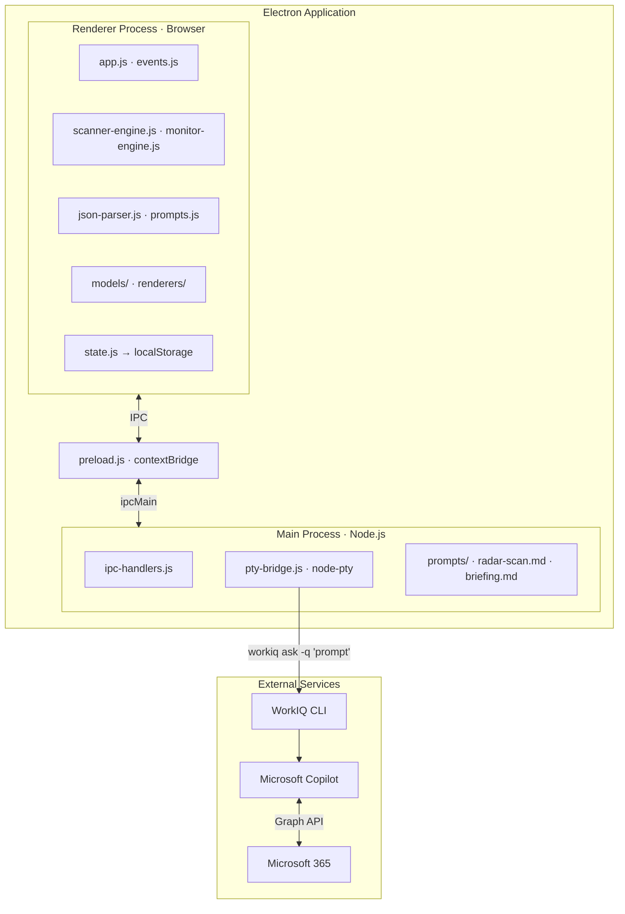

<div align="center">
  <p>
    
    <picture>
      <source media="(prefers-color-scheme: dark)" srcset="docs/flightdeck-title-dark.svg">
      <source media="(prefers-color-scheme: light)" srcset="docs/flightdeck-title-light.svg">
      
    </picture>
  </p>
  <p><strong>Your personal work-intelligence dashboard</strong></p>

  [](LICENSE)
  
  
  
  [](CHANGELOG.md)
</div>

---

## Install

**Windows:**
```powershell
winget install FlightDeck.FlightDeck
```

**macOS:**
Download the latest `.dmg` from [GitHub Releases](../../releases/latest), open it, and drag FlightDeck to Applications.

### Prerequisites

- **Microsoft 365 Copilot license** — FlightDeck uses Copilot to analyze your M365 signals. A Copilot license must be assigned to your account.
- **WorkIQ CLI enabled** — Your tenant administrator must enable the WorkIQ CLI. FlightDeck communicates with Copilot through WorkIQ to ground responses in your real M365 data. See [tenant setup instructions](https://github.com/microsoft/work-iq/blob/main/ADMIN-INSTRUCTIONS.md).
- **Node.js** v18+ — Required on macOS to run the WorkIQ CLI. Install via [nodejs.org](https://nodejs.org/) or `brew install node`.
- **WorkIQ CLI** — Install globally: `npm i -g @microsoft/workiq`. On macOS, WorkIQ must be in your PATH (e.g. `/opt/homebrew/bin/workiq` or `/usr/local/bin/workiq`).

---

FlightDeck scans your Microsoft 365 signals — email, Teams, meetings, documents — and surfaces what needs your attention, ranked by priority. Track items over time with automated monitoring and walk into every meeting prepared with AI-generated briefings. All AI responses are grounded in your real M365 data with deep-link citations. Every prompt is visible and editable — no black boxes.


---

## Table of Contents

- [Install](#install)
- [Prerequisites](#prerequisites)
- [Features](#features)
- [Quick Start](#quick-start)
- [Build from Source](#build-from-source)
- [First Launch](#first-launch)
- [How It Works](#how-it-works)
- [Architecture](#architecture)
- [Testing](#testing)
- [Deployment](#deployment)
- [Configuration](#configuration)
- [Security](#security)
- [Tech Stack](#tech-stack)
- [Project Structure](#project-structure)
- [Contributing](#contributing)
- [License](#license)

---

## Features

| Feature | Description |
|---|---|
| 📡 **Radar** | AI-prioritized signals classified as Critical / Elevated / Observe, organized by scanner |
| 🔍 **Scanners** | Named, scheduled AI scans with customizable prompts, dedup, auto-monitor, and notification controls |
| 📌 **Tracking** | Enable monitoring on any item with configurable schedules, signals, and desktop notifications |
| 📋 **Briefings** | One-click AI meeting prep — headline, key updates, risks, talk track, and more |
| ☀️ **My Day** | Daily briefing synthesizing meetings, tracked items, and priorities into a morning summary |
| 🕘 **History** | Audit trail of every scan, update, and detected change |
| 🔍 **Search** | Global search (`Ctrl+K`) across all items and briefings |
| 🖥️ **System Tray** | Runs in the background; monitors schedules and delivers notifications even when minimized |
| 🌓 **Light / Dark Theme** | Toggle between light and dark modes; follows system preference by default |
| 🪟 **Pop-out Windows** | Open any tracked item in its own window with real-time sync |
| 🔔 **Version Notifications** | In-app update indicator when a new release is available |
| ♻️ **Lifecycle Management** | Items progress through in-progress → blocked → waiting → complete → archived with auto-detection |

> [!TIP]
> See [docs/user-guide.md](docs/user-guide.md) for the full user guide with screenshots and walkthrough of every feature.

[](../../releases/latest)

---

### 📡 Scan — surface what matters

FlightDeck scans your M365 signals using **Scanners** — named, scheduled AI scans that you configure with custom prompts. Each scanner runs on its own schedule and surfaces items ranked by urgency: **Critical**, **Elevated**, or **Observe**. Items include a summary, the people involved, source links, and suggested next steps.

### 📌 Track — monitor what you care about

Enable monitoring on any item, or add a custom tracked item directly to a scanner. FlightDeck monitors items on a schedule you configure — by interval, day/time, or one-time — and notifies you via desktop toast when it detects net-new data.


<details>
<summary><strong>Creating a custom tracked item</strong></summary>

1. Click the **+ button** in any scanner's section header
2. Fill in the form:
   - **Title** — what you're tracking (e.g., "Contoso contract renewal")
   - **Severity** — Critical, Elevated, or Observe
   - **Monitoring prompt** — tell the AI what to look for in plain English
3. The item is created with monitoring enabled

Alternatively, create a **Scanner** to automatically discover and track items:

1. Click **+ Scanner** at the top of the Radar view
2. Name your scanner, set a schedule, and write a prompt describing what signals to look for
3. FlightDeck runs the scanner on schedule, discovers items, and can auto-monitor them

See [docs/user-guide.md](docs/user-guide.md#scanners) for full details on scanner settings.

</details>

### 📋 Brief — prepare for every meeting

Generate AI-powered briefings for your upcoming meetings. Each briefing surfaces key updates, decisions needed, top risks, a talk track, and follow-ups — all sourced from your real M365 activity.


---

## Quick Start

[](../../releases/latest)

### Windows

1. **Download** the latest `.msi` from [GitHub Releases](../../releases/latest)
2. **Run the `.msi`** to install FlightDeck
3. **Install prerequisites** (if not already installed):
   - Install [Node.js](https://nodejs.org/) v18+
   - Install the WorkIQ CLI: `npm i -g @microsoft/workiq`
   - Ensure you have a Microsoft Copilot license and your tenant admin has [granted WorkIQ consent](https://www.npmjs.com/package/@microsoft/workiq#admin-setup)
4. **Launch FlightDeck** from the Start menu
5. **Click "Enable WorkIQ"** in the connect banner — FlightDeck auto-accepts the EULA and connects
6. **You're live!** — Set up your first Scanner on the Radar view, or switch to Briefings for meeting prep.

### macOS

1. **Download** the latest `.dmg` from [GitHub Releases](../../releases/latest)
2. **Open the `.dmg`** and drag FlightDeck to your Applications folder
3. **Install prerequisites** (if not already installed):
   - Install [Node.js](https://nodejs.org/) v18+ (or `brew install node`)
   - Install the WorkIQ CLI: `npm i -g @microsoft/workiq`
   - Ensure you have a Microsoft Copilot license and your tenant admin has [granted WorkIQ consent](https://www.npmjs.com/package/@microsoft/workiq#admin-setup)
4. **Launch FlightDeck** from Applications
5. **Click "Enable WorkIQ"** in the connect banner to connect
6. **You're live!** — Set up your first Scanner on the Radar view, or switch to Briefings for meeting prep.

> [!NOTE]
> On macOS, FlightDeck looks for `workiq` and `node` in `/opt/homebrew/bin`, `/usr/local/bin`, and `/usr/bin`. If you installed Node or WorkIQ to a non-standard location, ensure they are in your PATH.

> [!NOTE]
> Prefer to build from source? See [Build from Source](#build-from-source) below.

---

## Build from Source

### Prerequisites

| Requirement | Details |
|---|---|
| **Node.js** | v18 or later ([download](https://nodejs.org/)) |
| **WorkIQ CLI** | `npm i -g @microsoft/workiq` — installed globally |
| **Microsoft Copilot license** | Required by WorkIQ for M365 data access |
| **Tenant admin consent** | Your organization must [grant WorkIQ access](https://www.npmjs.com/package/@microsoft/workiq#admin-setup) to M365 signals |

### Install & Run

```bash
# Clone the repository
git clone <repo-url>
cd FlightDeck

# Install dependencies
npm install

# Start the application
npm start
```

### Build Installers

```bash
# Windows MSI
npm run dist

# macOS DMG
npm run dist:mac

# Linux AppImage + deb
npm run dist:linux
```

Build output goes to the `dist/` directory.

On first launch, click **Enable WorkIQ** in the connect banner (see [First Launch](#first-launch) below).

---

## First Launch

When you open FlightDeck for the first time:

1. **You'll see the Connect banner** at the top of the Radar tab with an **Enable WorkIQ** button.
2. **Click "Enable WorkIQ"** — FlightDeck will:
   - Automatically accept the WorkIQ EULA (auto-confirms Y/N prompts)
   - Run a health check to verify your WorkIQ connection
3. **Wait for the first scan** — Once connected, FlightDeck immediately runs a full refresh:
   - A **Radar scan** of your M365 signals (email, Teams, meetings, documents)
   - A **Meetings refresh** that pulls today's calendar
4. **You're live!** — The Radar populates with your M365 signals. Set up a Scanner to configure what you want to track, or switch to Briefings for meeting prep.

> [!TIP]
> **If "Enable WorkIQ" doesn't appear:** You may have connected in a previous session. FlightDeck remembers your connection state. If you see "Refresh failed" instead, FlightDeck will automatically detect the issue and re-show the Enable WorkIQ button.

<details>
<summary><strong>Troubleshooting</strong></summary>

If the health check fails, verify:

1. The WorkIQ CLI is installed: `npm i -g @microsoft/workiq`
2. Your Copilot license and tenant consent are set up
3. Test the CLI directly: `workiq ask -q "Hello"`

</details>

---

## How It Works

1. FlightDeck loads a **prompt template** (`radar-scan.md`, `scanner-template.md`, `briefing.md`, or `day-briefing.md`) and appends a JSON schema suffix
2. The prompt is sent via IPC to the **main process**, which spawns a `node-pty` pseudo-terminal running the WorkIQ CLI
3. WorkIQ forwards the prompt to **Microsoft Copilot**, which queries **Microsoft Graph** for the user's M365 data
4. The grounded AI response (JSON + citations) flows back through the PTY, gets ANSI-stripped and parsed
5. The **renderer** normalizes the payload, updates the UI, and persists state to localStorage

### Monitoring Engine

Two engines run in parallel in the renderer:

**Scanner Engine** — A periodic tick checks all enabled scanners against their schedules. When a scanner is due, it runs the scanner’s prompt through WorkIQ, processes the response into items, deduplicates against existing items, and appends new discoveries to the unified item list. Scanners support interval, weekly, and one-time schedules, with missed-run policies (skip, run-once, catch-up).

**Monitor Engine** — A **30-second tick** checks all monitored items against their individual schedules:

| Schedule Type | Behavior |
|---|---|
| **Interval** | Every 15 minutes to 4 hours |
| **Weekly** | Specific days and times |
| **One-time** | Runs once, then auto-disables |

Each monitoring check includes the last two update summaries for de-duplication, so the LLM only reports genuinely new information. Change detection uses field-level signature hashing; only substantive changes (status, severity, meaningful summary updates) trigger desktop notifications.

### State Persistence

| What | Where |
|---|---|
| Window bounds & maximized state | `<userData>/window-state.json` |
| Radar items, tracking items, briefings, history, scanners, preferences | `localStorage` key `flightdeck.persisted.v2` |
| Custom prompts (radar, briefing, day-briefing) | `localStorage` keys `flightdeck.prompt.*` |
| Cold storage items (archived/completed after 24h) | `localStorage` via `window.workiq.getColdItems` |

History is auto-pruned to **200 entries / 30 days**. Stale briefings (for past meetings) are pruned on load.

---

## Architecture

> [!NOTE]
> See [docs/architecture-diagrams.md](docs/architecture-diagrams.md) for detailed Mermaid diagrams covering the system architecture, WorkIQ call pipeline, monitoring engine, security model, and RAI notes.



---

## Testing

Tests use the **Node.js built-in test runner** — no extra framework required.

```bash
npm test
```

<details>
<summary><strong>Test coverage details</strong></summary>

| File | Covers |
|---|---|
| `main-utils.test.js` | URL normalization, HTML escaping, markdown→HTML |
| `main-window-state.test.js` | State load/save, on-screen detection |
| `main-pty-bridge.test.js` | ANSI stripping, Node executable discovery |
| `main-ipc-handlers.test.js` | IPC channel handler logic |
| `main-ipc-tracker-popout.test.js` | Tracker pop-out IPC |
| `renderer-utils.test.js` | Renderer utility functions |
| `renderer-json-parser.test.js` | JSON extraction from LLM output |
| `renderer-models-tracking.test.js` | Schedule computation, item normalization |
| `renderer-models-radar.test.js` | Radar payload processing |
| `renderer-models-briefing.test.js` | Briefing model logic |
| `renderer-day-briefing.test.js` | Day-level briefing generation |
| `renderer-tracking-renderers.test.js` | Tracking DOM renderers |
| `renderer-popout.test.js` | Pop-out window sync |
| `renderer-state.test.js` | State persistence & migration |
| `renderer-prompts.test.js` | Prompt template builders |
| `renderer-scanner-engine.test.js` | Scanner engine scheduling |
| `renderer-move-item.test.js` | Item move/reorder logic |
| `renderer-delete-scanner.test.js` | Scanner deletion and item cleanup |

</details>

---

## Deployment

FlightDeck is a desktop Electron app — there is no server to deploy.

| Method | Steps |
|---|---|
| **Windows MSI** | Download from [Releases](../../releases/latest) and distribute to users. Per-machine install, no admin required. |
| **macOS DMG** | Download the `.dmg` from [Releases](../../releases/latest). Open and drag to Applications. |
| **Build your own installer** | Clone the repo, run `npm install`, then `npm run dist` (Windows) or `npm run dist:mac` (macOS). Output goes to `dist/`. |
| **Run from source** | Clone, `npm install`, `npm start`. No build step needed for development. |

> [!IMPORTANT]
> Users must have their own Microsoft Copilot license and tenant admin consent for WorkIQ. FlightDeck does not require a backend server — all AI processing is handled by WorkIQ → Copilot → Microsoft Graph.

---

## Configuration

FlightDeck does not require a separate config file. All user-facing settings are managed in-app:

| Setting | How |
|---|---|
| **Scanners** | Create, edit, pause, and delete scanners via the Radar view |
| **Scanner prompt** | Editable per scanner via the ⚙️ settings button |
| **Briefing prompt** | Editable via the in-app prompt editor panel |
| **Monitoring schedules** | Per-item interval, weekly, or one-time |
| **Theme** | Toggle via the sun/moon button in the header |
| **Density** | Full or minimal card density on the Radar view |

---

## Security

- **Context Isolation** enabled; `nodeIntegration` disabled
- **Content Security Policy**: `default-src 'self'; style-src 'self'; script-src 'self'`
- External URLs are intercepted and opened in the system browser — never inside the Electron window
- URL validation rejects non-HTTP(S) schemes before opening
- HTML in LLM output is escaped before rendering

---

## Tech Stack

| Component | Technology |
|---|---|
| Desktop shell | [Electron](https://www.electronjs.org/) 35+ |
| Terminal bridge | [node-pty](https://github.com/microsoft/node-pty) |
| AI backend | [WorkIQ CLI](https://www.npmjs.com/package/@microsoft/workiq) (Microsoft Copilot) |
| Renderer | Vanilla HTML / CSS / JS (no framework, no bundler) |
| Tests | Node.js built-in `node:test` |
| Persistence | `localStorage` + JSON file for window state |

---

## Project Structure

<details>
<summary><strong>Expand full project tree</strong></summary>

```
FlightDeck/
├── src/                        # Application source code
│   ├── main/                   # Electron main process
│   │   ├── index.js            # App lifecycle, window & tray creation
│   │   ├── ipc-handlers.js     # IPC channel handlers (ask-workiq, popout, etc.)
│   │   ├── pty-bridge.js       # node-pty bridge to WorkIQ CLI
│   │   ├── store.js            # electron-store persistence
│   │   ├── utils.js            # Logging, URL safety, HTML/markdown helpers
│   │   ├── window-state.js     # Persist & restore window bounds
│   │   └── ipc/
│   │       └── tracker-popout.js  # Popout window IPC handlers
│   ├── renderer/               # Renderer process (plain JS, no bundler)
│   │   ├── app.js              # Bootstrap & tab routing
│   │   ├── constants.js        # JSON schemas & prompt suffixes
│   │   ├── demo.js             # Demo mode fixture loading
│   │   ├── events.js           # DOM event wiring
│   │   ├── json-parser.js      # Extract JSON from LLM output
│   │   ├── monitor-engine.js   # Scheduled-scan tick engine (per-item monitoring)
│   │   ├── scanner-engine.js   # Scanner tick engine (scheduled scanner runs)
│   │   ├── popout.js           # Pop-out window sync
│   │   ├── prompts.js          # Prompt editor panel logic
│   │   ├── search.js           # Global search (Ctrl+K)
│   │   ├── state.js            # localStorage persistence layer
│   │   ├── theme.js            # Light/dark theme toggle
│   │   ├── utils.js            # Renderer-side utilities
│   │   ├── models/             # Data-model helpers
│   │   │   ├── briefing.js     # Briefing normalization & caching
│   │   │   ├── item.js         # Unified item model (radar + tracking)
│   │   │   ├── radar.js        # Radar payload processing
│   │   │   ├── scanner.js      # Scanner CRUD & schedule computation
│   │   │   └── tracking.js     # Schedule computation & change detection
│   │   └── renderers/          # DOM rendering functions
│   │       ├── actions.js      # Suggested-action chips & draft generation
│   │       ├── briefing.js     # Briefing cards & My Day
│   │       ├── history.js      # History list
│   │       ├── kpi.js          # KPI summary, severity bar
│   │       ├── radar.js        # Unified item cards & scanner sections
│   │       ├── scanner.js      # Scanner settings form & modal
│   │       └── tracking.js     # Item monitoring controls & schedule UI
│   ├── prompts/                # Markdown prompt templates sent to WorkIQ
│   │   ├── radar-scan.md       # Default radar scan prompt
│   │   ├── briefing.md         # Meeting briefing prompt
│   │   ├── day-briefing.md     # My Day briefing prompt
│   │   └── scanner-template.md # Scanner prompt template
│   ├── shared/                 # Code shared between main & renderer
│   │   └── ipc-contract.js     # IPC channel name constants
│   ├── styles/                 # CSS (design tokens + component sheets)
│   ├── index.html              # Single-page shell
│   └── preload.js              # contextBridge → window.workiq API
├── test/                       # Tests (Node.js built-in test runner)
│   └── helpers/                # Electron mocks & renderer context stubs
├── docs/                       # Architecture & design documentation
└── package.json
```

</details>

---

## Contributing

Contributions are welcome! Whether it's a bug report, feature idea, or a pull request — we'd love your help.

See [CONTRIBUTING.md](CONTRIBUTING.md) for development setup, coding conventions, branching workflow, and the release process.

---

## License

This project is licensed under the [Apache License 2.0](LICENSE).
