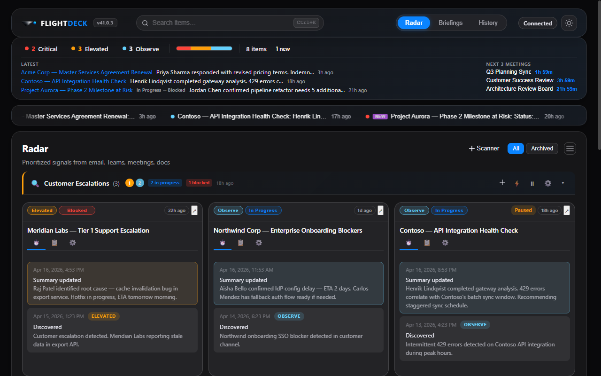

<div align="center">
  <p>
    
    <picture>
      <source media="(prefers-color-scheme: dark)" srcset="docs/flightdeck-title-dark.svg">
      <source media="(prefers-color-scheme: light)" srcset="docs/flightdeck-title-light.svg">
      
    </picture>
  </p>
  <p><strong>Your personal work-intelligence dashboard</strong></p>

  [](LICENSE)
  
  
  
  
  [](CHANGELOG.md)
</div>

---

FlightDeck scans your Microsoft 365 signals — email, Teams, meetings, documents — and surfaces what needs your attention, ranked by priority. Track items over time with automated monitoring and walk into every meeting prepared with AI-generated briefings. All AI responses are grounded in your real M365 data with deep-link citations. Every prompt is visible and editable — no black boxes.


---

## Table of Contents

- [Features](#features)
- [Prerequisites](#prerequisites)
- [Quick Start](#quick-start)
- [Demo Mode](#demo-mode)
- [Project Structure](#project-structure)
- [Architecture](#architecture)
- [Data Persistence](#data-persistence)
- [Scripts Reference](#scripts-reference)
- [Testing](#testing)
- [Security](#security)
- [Contributing](#contributing)
- [License](#license)

---

## Features

| Feature | Description |
|---|---|
| 📡 **Radar** | AI-prioritized signals classified as Critical / Elevated / Observe, organized by scanner |
| 🔍 **Scanners** | Named, scheduled AI scans with customizable prompts, dedup, auto-monitor, and notification controls |
| 📌 **Tracking** | Enable monitoring on any item with configurable schedules, signals, and desktop notifications |
| 📋 **Briefings** | One-click AI meeting prep — headline, key updates, risks, talk track, and more |
| ☀️ **My Day** | Daily briefing synthesizing meetings, tracked items, and priorities into a morning summary |
| 🕘 **History** | Audit trail of every scan, update, and detected change |
| 🔎 **Search** | Global search (`Ctrl+K`) across all items and briefings |
| 🖥️ **System Tray** | Runs in the background; monitors schedules and delivers notifications even when minimized |
| 🌓 **Light / Dark Theme** | Toggle between light and dark modes; follows system preference by default |
| 🪟 **Pop-out Windows** | Open any tracked item in its own window with real-time sync |
| ♻️ **Lifecycle Management** | Items progress through in-progress → blocked → waiting → complete → archived with auto-detection |

> [!TIP]
> See [docs/user-guide.md](docs/user-guide.md) for the full user guide with screenshots and walkthrough of every feature.

### 📡 Scan — surface what matters

Scanners are named, scheduled AI scans that you configure with custom prompts. Each scanner runs on its own schedule and surfaces items ranked by urgency: **Critical**, **Elevated**, or **Observe**. Items include a summary, the people involved, source links, and suggested next steps.

### 📌 Track — monitor what you care about

Enable monitoring on any item, or add a custom tracked item directly to a scanner. FlightDeck monitors items on a schedule you configure — by interval, day/time, or one-time — and notifies you via desktop toast when it detects net-new data.



### 📋 Brief — prepare for every meeting

Generate AI-powered briefings for your upcoming meetings. Each briefing surfaces key updates, decisions needed, top risks, a talk track, and follow-ups — all sourced from your real M365 activity.


---

## Prerequisites

| Requirement | Details |
|---|---|
| **Node.js** | v18 or later ([download](https://nodejs.org/)) |
| **WorkIQ CLI** | `npm i -g @microsoft/workiq` — installed globally |
| **Microsoft Copilot license** | Required by WorkIQ for M365 data access |
| **Tenant admin consent** | Your organization must [grant WorkIQ access](https://www.npmjs.com/package/@microsoft/workiq#admin-setup) to M365 signals |

---

## Quick Start

### Install from release

**Windows:**
```powershell
winget install FlightDeck.FlightDeck
```

**macOS:**
Download the latest `.dmg` from [GitHub Releases](../../releases/latest), open it, and drag FlightDeck to Applications.

### Build from source

```bash
git clone <repo-url>
cd FlightDeck
npm install
npm start          # builds the renderer then launches Electron
```

On first launch, click **Enable WorkIQ** in the connect banner — FlightDeck auto-accepts the EULA and connects. Once connected, a Radar scan and calendar refresh run immediately.

> [!NOTE]
> On macOS, FlightDeck looks for `workiq` and `node` in `/opt/homebrew/bin`, `/usr/local/bin`, and `/usr/bin`. If you installed Node or WorkIQ to a non-standard location, ensure they are in your PATH.

### Build installers

```bash
npm run dist          # Windows MSI
npm run dist:mac      # macOS DMG
npm run dist:linux    # Linux AppImage + deb
```

Build output goes to the `dist/` directory.

---

## Demo Mode

Demo mode loads synthetic fixture data so you can explore FlightDeck without a WorkIQ connection or Copilot license.

```bash
npm run demo            # launch with cached demo data
npm run demo:reseed     # regenerate fixtures, then launch
```

Demo mode is read-only — scanners and monitoring are disabled.

---

## Project Structure

```
FlightDeck/
├── src/
│   ├── main/                      # Electron main process
│   │   ├── index.js               # App lifecycle, window & tray creation
│   │   ├── ipc-handlers.js        # IPC channel handlers (ask-workiq, store, popout, …)
│   │   ├── pty-bridge.js          # node-pty bridge to WorkIQ CLI
│   │   ├── store.js               # electron-store persistence (flightdeck-data, flightdeck-cold)
│   │   ├── utils.js               # Logging, URL safety, HTML/markdown helpers
│   │   ├── window-state.js        # Persist & restore window bounds
│   │   └── ipc/
│   │       └── tracker-popout.js  # Popout window IPC handlers
│   ├── svelte/                    # Renderer process (Svelte 5 + Vite)
│   │   ├── App.svelte             # Root component — routing, engines, persistence
│   │   ├── main.js                # Main window entry point
│   │   ├── popout.js              # Pop-out window entry point
│   │   ├── components/            # UI components (27 Svelte files)
│   │   │   ├── RadarView.svelte
│   │   │   ├── BriefingsView.svelte
│   │   │   ├── HistoryView.svelte
│   │   │   ├── TrackerCard.svelte
│   │   │   ├── ScannerSection.svelte
│   │   │   ├── SearchOverlay.svelte
│   │   │   └── …
│   │   └── lib/                   # Core logic & state
│   │       ├── stores.js          # Svelte reactive stores (items, scanners, meetings, …)
│   │       ├── persistence.js     # electron-store read/write via IPC
│   │       ├── scanner-engine.js  # Scanner tick engine
│   │       ├── monitor-engine.js  # Per-item monitoring tick engine
│   │       ├── json-parser.js     # Extract JSON from LLM output
│   │       ├── prompts.js         # Prompt template builders
│   │       ├── actions.js         # History, item CRUD helpers
│   │       ├── utils.js           # Renderer-side utilities
│   │       └── models/            # Data-model helpers (item, scanner, tracking)
│   ├── prompts/                   # Markdown prompt templates sent to WorkIQ
│   │   ├── radar-scan.md
│   │   ├── briefing.md
│   │   ├── day-briefing.md
│   │   └── scanner-template.md
│   ├── shared/
│   │   └── ipc-contract.js        # IPC channel name constants
│   ├── styles/                    # CSS (design tokens + component sheets)
│   ├── app.html                   # Main window HTML shell
│   ├── popout.html                # Popout window HTML shell
│   └── preload.js                 # contextBridge → window.workiq API
├── dist-renderer/                 # Vite build output (generated)
├── test/                          # Tests (Node.js built-in test runner)
│   └── helpers/                   # Electron mocks
├── docs/                          # Architecture docs & screenshots
├── scripts/                       # Tooling (screenshot capture)
├── vite.config.js                 # Vite + Svelte build configuration
├── svelte.config.js               # Svelte compiler config
└── package.json
```

---

## Architecture

FlightDeck is an Electron app with a **Svelte 5** renderer built by **Vite**.

```
┌──────────────────────────────────────────────────────┐
│  Renderer  (Svelte 5 · dist-renderer/)               │
│  stores.js ←→ persistence.js ──IPC──→ electron-store │
│  scanner-engine.js / monitor-engine.js               │
│  json-parser.js / prompts.js                         │
├──────────────────────────────────────────────────────┤
│  preload.js  (contextBridge → window.workiq)         │
├──────────────────────────────────────────────────────┤
│  Main Process  (Node.js)                             │
│  ipc-handlers.js → pty-bridge.js → node-pty          │
│  store.js (electron-store)                           │
└──────────────┬───────────────────────────────────────┘
               │ workiq ask -q "prompt"
               ▼
        WorkIQ CLI → Microsoft Copilot → Microsoft Graph (M365)
```

1. The renderer loads a **prompt template** and sends it via IPC to the main process
2. The main process spawns a `node-pty` pseudo-terminal running the WorkIQ CLI
3. WorkIQ forwards the prompt to **Microsoft Copilot**, which queries **Microsoft Graph**
4. The JSON response flows back through the PTY, gets ANSI-stripped and parsed
5. The renderer normalizes the payload, updates Svelte stores, and persists state to **electron-store** via IPC

> See [docs/architecture.md](docs/architecture.md) and [docs/architecture-diagrams.md](docs/architecture-diagrams.md) for detailed Mermaid diagrams.

---

## Data Persistence

All application state is persisted via **electron-store** (JSON files in the OS user-data directory), accessed from the renderer through IPC calls to the main process.

| What | Store | Key / Location |
|---|---|---|
| Radar items, scanners, briefings, history, preferences | `flightdeck-data` | Per-field keys via `storeGet` / `storeSet` |
| Archived / completed items (cold storage) | `flightdeck-cold` | `items` |
| Window bounds & maximized state | File | `<userData>/window-state.json` |
| Theme preference | `localStorage` | `fd-theme` (only theme uses localStorage) |

History is auto-pruned to **200 entries / 30 days**. Stale briefings (for past meetings) are pruned on load.

---

## Scripts Reference

| Script | Command | Description |
|---|---|---|
| **start** | `npm start` | Build renderer then launch Electron |
| **dev** | `npm run dev` | Vite dev server (renderer only, hot reload) |
| **build:renderer** | `npm run build:renderer` | Vite production build → `dist-renderer/` |
| **demo** | `npm run demo` | Launch with demo fixture data |
| **demo:reseed** | `npm run demo:reseed` | Regenerate demo fixtures, then launch |
| **screenshots** | `npm run screenshots` | Capture screenshots via Playwright |
| **test** | `npm test` | Run all tests (Node.js built-in test runner) |
| **dist** | `npm run dist` | Build renderer + Windows MSI installer |
| **dist:mac** | `npm run dist:mac` | Build renderer + macOS DMG |
| **dist:linux** | `npm run dist:linux` | Build renderer + Linux AppImage/deb |

---

## Testing

Tests use the **Node.js built-in test runner** — no extra framework required.

```bash
npm test
```

| File | Covers |
|---|---|
| `main-utils.test.js` | URL normalization, HTML escaping, markdown→HTML |
| `main-window-state.test.js` | State load/save, on-screen detection |
| `main-pty-bridge.test.js` | ANSI stripping, Node executable discovery |
| `main-ipc-handlers.test.js` | IPC channel handler logic |
| `main-ipc-tracker-popout.test.js` | Tracker pop-out IPC |

---

## Security

- **Context Isolation** enabled; `nodeIntegration` disabled
- **Content Security Policy**: `default-src 'self'; style-src 'self'; script-src 'self'`
- External URLs are intercepted and opened in the system browser — never inside the Electron window
- URL validation rejects non-HTTP(S) schemes before opening
- HTML in LLM output is escaped before rendering
- All renderer ↔ main communication goes through a typed IPC contract (`ipc-contract.js`)

---

## Tech Stack

| Component | Technology |
|---|---|
| Desktop shell | [Electron](https://www.electronjs.org/) 35+ |
| UI framework | [Svelte](https://svelte.dev/) 5 |
| Build tool | [Vite](https://vite.dev/) 8 |
| Terminal bridge | [node-pty](https://github.com/microsoft/node-pty) |
| AI backend | [WorkIQ CLI](https://www.npmjs.com/package/@microsoft/workiq) (Microsoft Copilot) |
| Persistence | [electron-store](https://github.com/sindresorhus/electron-store) |
| Tests | Node.js built-in `node:test` |
| Screenshots | [Playwright](https://playwright.dev/) |

---

## Contributing

Contributions are welcome! Whether it's a bug report, feature idea, or a pull request — we'd love your help.

See [CONTRIBUTING.md](CONTRIBUTING.md) for development setup, coding conventions, branching workflow, and the release process.

---

## License

This project is licensed under the [Apache License 2.0](LICENSE).