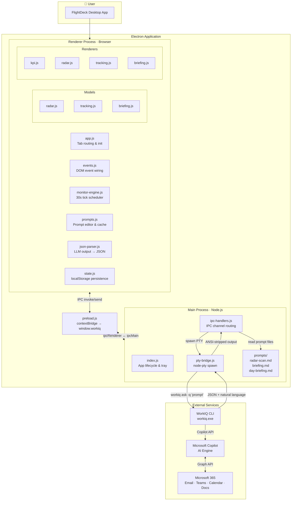
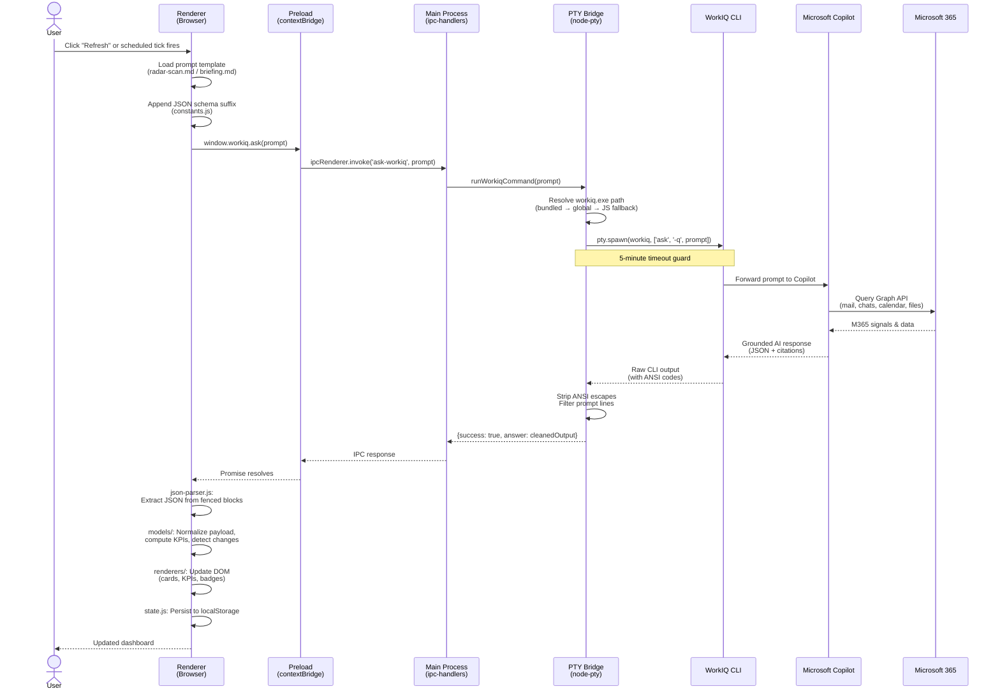
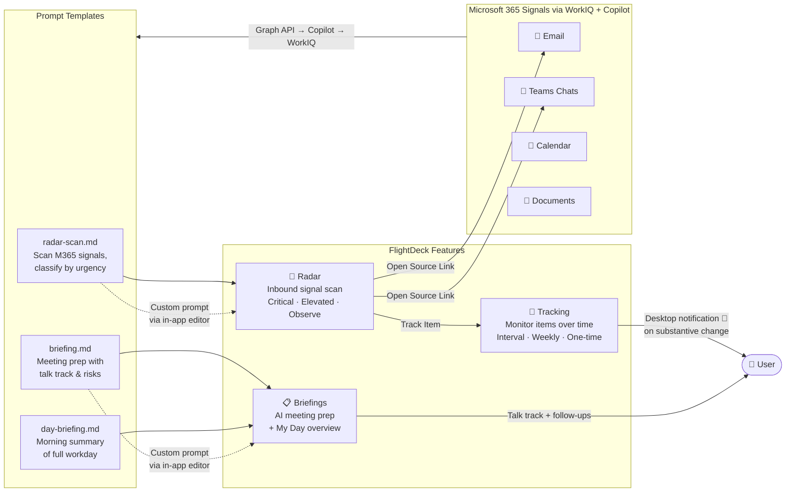
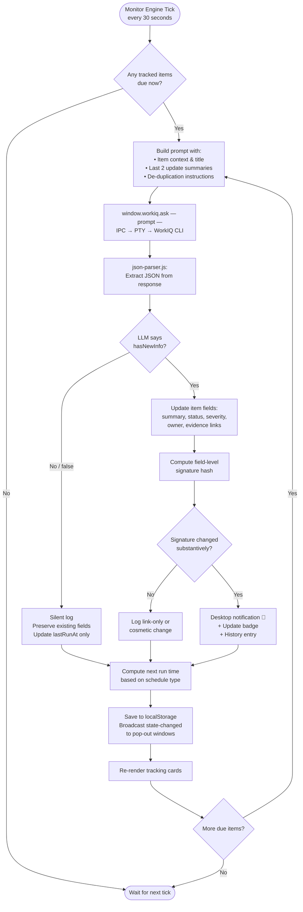
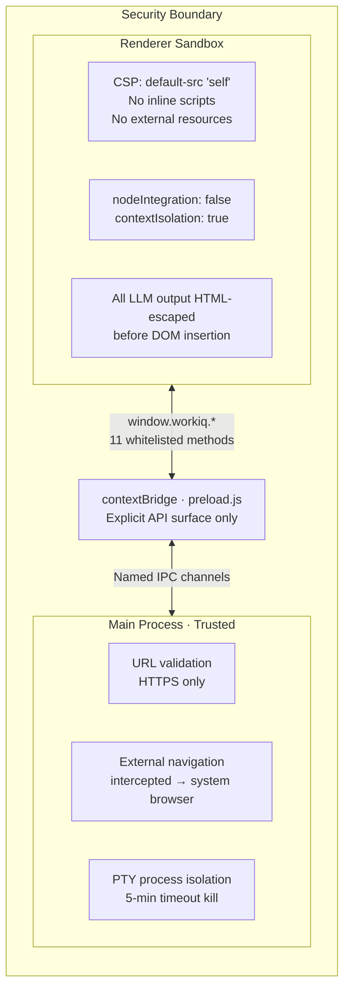

# FlightDeck Architecture Diagrams

Visual architecture documentation for FlightDeck — a personal work-intelligence dashboard that connects to Microsoft 365 via WorkIQ and Microsoft Copilot.

---

## 1. System Architecture

How FlightDeck's Electron app, WorkIQ CLI, Microsoft Copilot, and Microsoft 365 connect end-to-end.

**Key architecture decisions:**
- **Electron with context isolation** — The renderer is sandboxed. All Node.js access goes through `preload.js`, which exposes exactly 11 whitelisted methods via `window.workiq`.
- **PTY bridge, not HTTP** — WorkIQ is a CLI tool, not an API. FlightDeck uses `node-pty` to spawn pseudo-terminal sessions, which handles interactive prompts (like EULA acceptance) and streaming output.
- **No framework, no bundler** — The renderer is vanilla HTML/CSS/JS. This keeps the build chain minimal and the codebase auditable.

---

## 2. WorkIQ Call Pipeline

The complete data flow when FlightDeck sends a prompt to WorkIQ and renders the result.

**What makes this interesting:**
- **Prompt engineering is the product** — Each feature (Radar, Briefings, Tracking) is driven by a carefully crafted markdown prompt that instructs Copilot on what to look for, how to classify it, and what JSON schema to return.
- **In-app prompt editor** — Users can customize the radar and briefing prompts directly in the app. FlightDeck persists customizations to localStorage and falls back to the bundled defaults.
- **Robust JSON extraction** — LLM output isn't pure JSON. The parser handles fenced code blocks, mixed text, Unicode artifacts, trailing commas, and ANSI contamination.

---

## 3. Feature Modes & Prompt Flow

How FlightDeck's three core features connect to prompt templates and M365 data.

| Feature | Prompt | What it does |
|---------|--------|--------------|
| **Radar** | `radar-scan.md` | Scans email, Teams, calendar, and documents for signals that need attention. Classifies each as Critical, Elevated, or Observe. Returns evidence links with deep URLs back to the source. |
| **Tracking** | Dynamic per-item | Monitors a specific item on a user-configured schedule. Includes the last 2 update summaries for de-duplication so the LLM only reports *new* information. |
| **Briefings** | `briefing.md` / `day-briefing.md` | Generates meeting prep (key updates, decisions needed, risks, talk track, follow-ups) or a full "My Day" morning briefing. |

---

## 4. Monitoring Engine — Scheduled Task Update Cycle

The background engine that keeps tracked items up to date.

**How change detection works:**
1. Each tracked item has a **signature hash** computed from its status, severity, summary, and evidence links.
2. After the LLM returns an update, FlightDeck computes a new signature and compares it to the previous one.
3. Only **substantive changes** (status, severity, or meaningful summary differences) trigger desktop notifications. Link-only or cosmetic changes are logged silently.
4. The LLM's `hasNewInfo` flag provides a first-pass filter — if the LLM says nothing changed, FlightDeck preserves all existing fields to prevent signature drift from rephrasing.

---

## 5. Security Model

How FlightDeck isolates the renderer from Node.js and validates external content.

| Layer | Measure |
|-------|---------|
| **Content Security Policy** | `default-src 'self'; style-src 'self'; script-src 'self'` — no inline scripts, no external resources |
| **Context isolation** | Renderer cannot access Node.js APIs directly |
| **Node integration** | Explicitly disabled |
| **IPC surface** | Only 11 named channels exposed through `preload.js` |
| **External navigation** | All navigation attempts intercepted and opened in the system browser, never in the Electron window |
| **URL validation** | Non-HTTPS schemes rejected before opening |
| **LLM output sanitization** | All AI-generated text is HTML-escaped before DOM insertion to prevent injection |
| **PTY timeout** | 5-minute hard timeout kills hung WorkIQ processes |

---

## 6. Responsible AI (RAI) Notes

| Concern | Mitigation |
|---------|------------|
| **Data access scope** | FlightDeck accesses only the signed-in user's own M365 data via WorkIQ + Microsoft Copilot. No cross-tenant or cross-user data access. Requires tenant admin consent. |
| **AI grounding** | All Copilot responses are grounded in the user's real M365 signals (email, Teams, calendar, documents). FlightDeck prompts explicitly request citations and evidence links back to source content. |
| **Hallucination mitigation** | JSON schema constraints in prompts enforce structured output. The parser validates response structure before rendering. Evidence links are validated against known URL patterns (Outlook, Teams, SharePoint). |
| **No data storage beyond device** | All user data is stored locally in `localStorage` and a window-state JSON file. No data is sent to external servers beyond the existing WorkIQ → Copilot → Graph API path. |
| **Prompt transparency** | Users can view and edit the exact prompts sent to Copilot via the in-app prompt editor. No hidden instructions. |
| **LLM output sanitization** | All AI-generated text is HTML-escaped before rendering. No raw HTML or script content from AI responses reaches the DOM. |
| **EULA and consent** | WorkIQ requires explicit EULA acceptance. FlightDeck auto-detects when the EULA needs re-acceptance and surfaces the "Enable WorkIQ" flow. |
