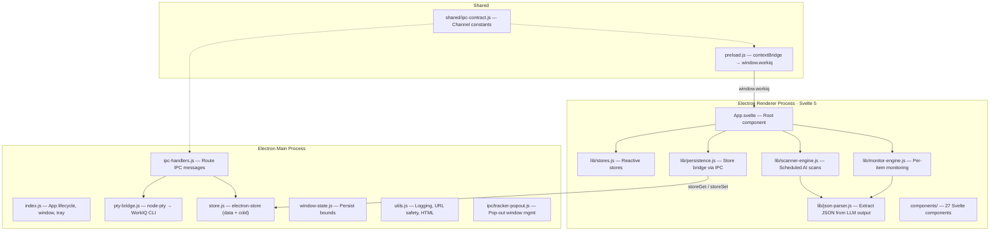
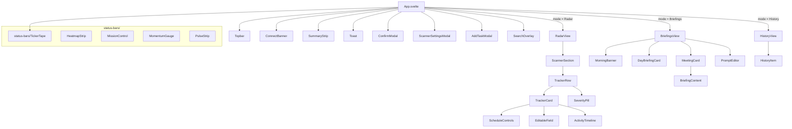
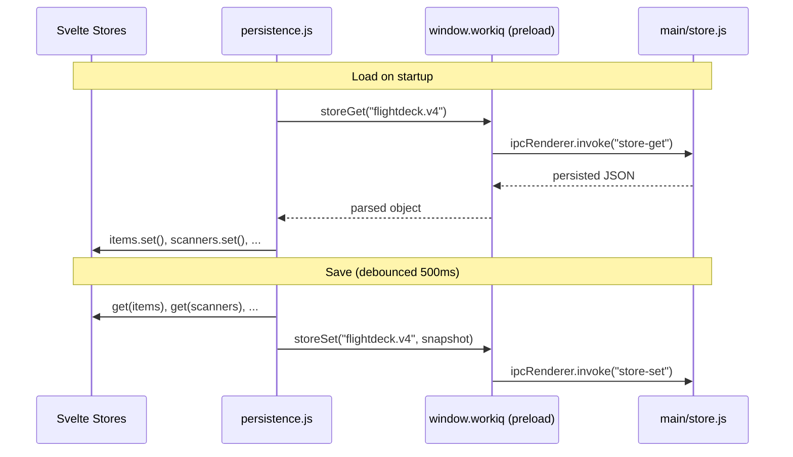
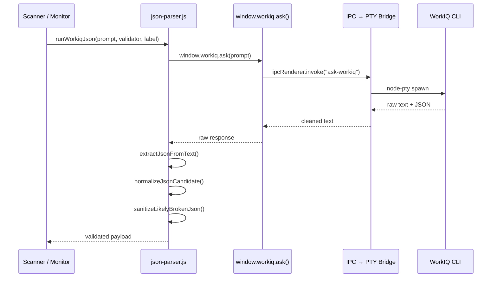
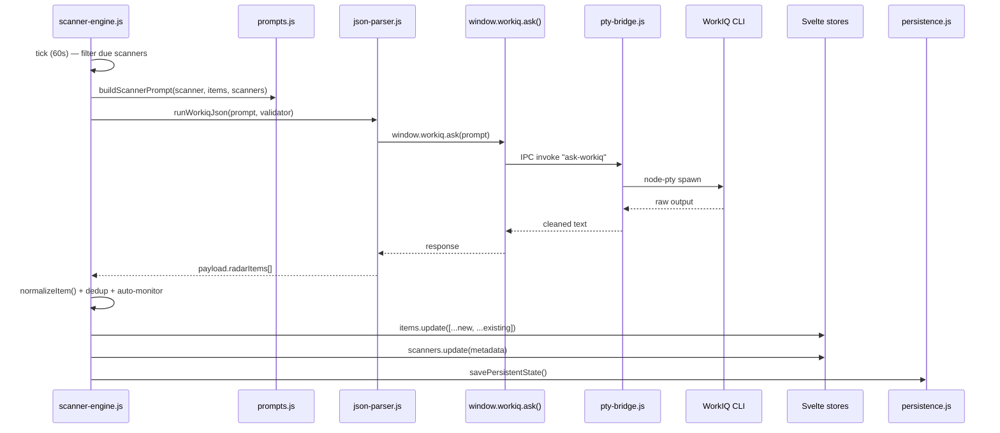
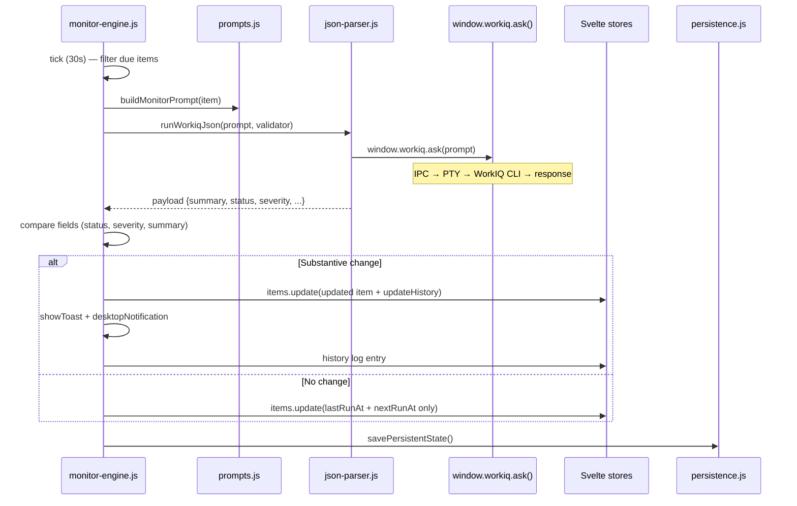
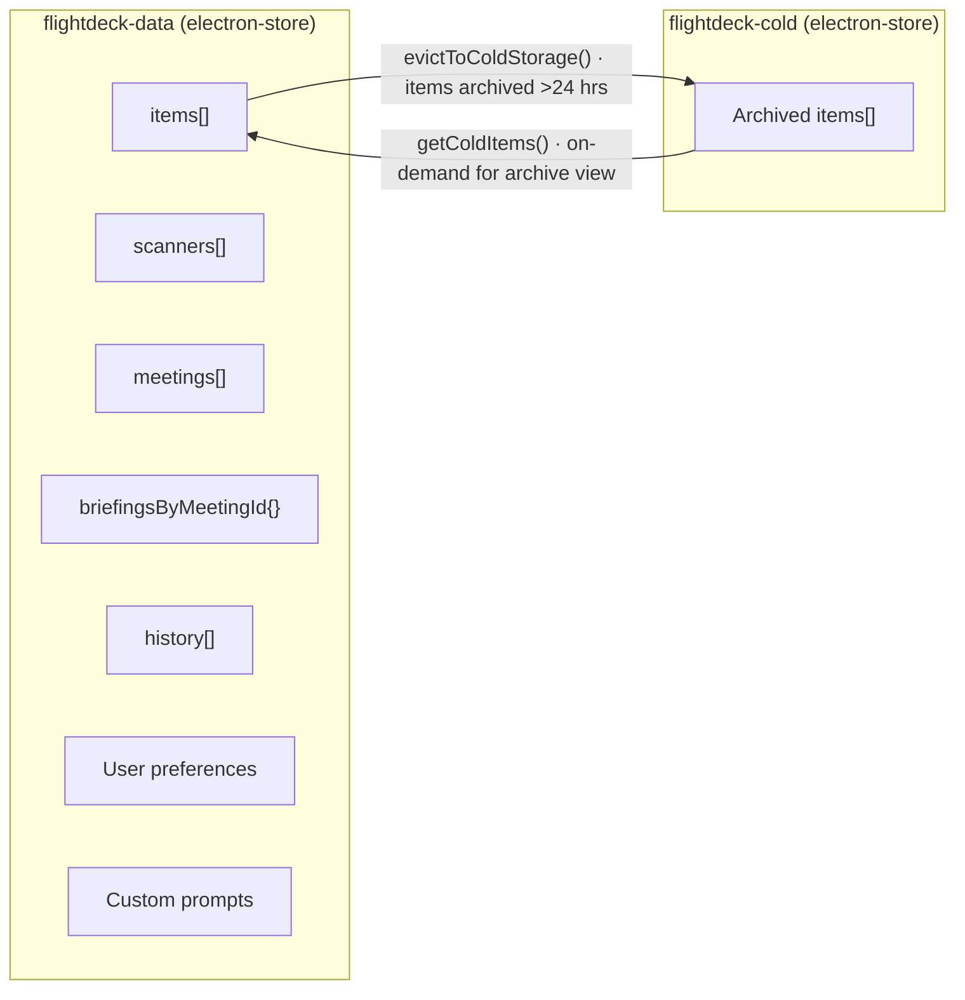

# FlightDeck Architecture

This document describes the internal architecture of FlightDeck for developers working on the codebase.

---

## System Overview

FlightDeck is an Electron desktop application with a strict two-process architecture. The **main process** manages the OS window, tray, persistence, and WorkIQ CLI communication. The **renderer process** runs a Svelte 5 SPA with reactive stores, background engines, and IPC-bridged persistence.

---

## Main Process

### App Lifecycle (`src/main/index.js`)

- Creates the main `BrowserWindow` with context isolation and CSP.
- Restores saved window state (position, size, maximized).
- Creates a system tray icon with "Open" and "Quit" menu items.
- Minimizing or closing the window **hides it to the tray** — the app stays alive for background monitoring.
- `window-all-closed` is intentionally a no-op.
- Only tray menu "Quit" or `app.quit()` terminates the process.

### IPC Handlers (`src/main/ipc-handlers.js`)

All renderer↔main communication flows through named IPC channels defined in `shared/ipc-contract.js` and exposed via `preload.js`. Pop-out window IPC is extracted into `src/main/ipc/tracker-popout.js`.

| Channel | Direction | Purpose |
|---|---|---|
| `get-app-version` | Renderer → Main | Return the app version string |
| `check-for-updates` | Renderer → Main | Check GitHub Releases for a newer version |
| `ask-workiq` | Renderer → Main | Execute a WorkIQ CLI query via PTY bridge |
| `accept-workiq-eula` | Renderer → Main | Run WorkIQ EULA acceptance via PTY |
| `read-prompt-file` | Renderer → Main | Load a markdown prompt template from `src/prompts/` |
| `open-markdown-window` | Renderer → Main | Open rendered markdown in a new window |
| `open-tracker-popout` | Renderer → Main | Pop out a tracking item into its own window |
| `open-external` | Renderer → Main | Open a URL in the system browser (with validation) |
| `show-desktop-notification` | Renderer → Main | Display an OS-level notification |
| `store-get` | Renderer → Main | Read a key from electron-store |
| `store-set` | Renderer → Main | Write a key/value to electron-store |
| `store-delete` | Renderer → Main | Delete a key from electron-store |
| `store-get-all` | Renderer → Main | Return all store contents |
| `store-get-size` | Renderer → Main | Return file size of the store on disk |
| `store-migrate-from-localstorage` | Renderer → Main | One-time migration from localStorage |
| `store-get-cold-items` | Renderer → Main | Read archived items from cold storage |
| `store-set-cold-items` | Renderer → Main | Write archived items to cold storage |
| `tracker-state-changed` | Renderer → Main (broadcast) | Notify all windows that shared state changed |
| `tracker-state-sync` | Main → Renderer | Tell a window to reload state |
| `notification-clicked` | Main → Renderer | Forward notification click for navigation |

### PTY Bridge (`src/main/pty-bridge.js`)

- Locates the WorkIQ launcher at `%APPDATA%/npm/node_modules/@microsoft/workiq/bin/workiq.js`.
- Spawns a `node-pty` pseudo-terminal: `node workiq.js ask -q "<prompt>"`.
- Collects output, strips ANSI escape sequences, and filters prompt lines.
- Enforces a **5-minute hard timeout** — kills the PTY process if it hangs.
- Returns cleaned text to the IPC handler.

### Window State (`src/main/window-state.js`)

- Saves `{ bounds: { x, y, width, height }, isMaximized }` to `<userData>/window-state.json`.
- Debounced (500 ms) on resize/move events to avoid excessive writes.
- On startup, restores position only if saved bounds are visible on a connected display.

### Persistent Store (`src/main/store.js`)

- Wraps `electron-store` to provide key/value persistence backed by a JSON file on disk.
- **Data store** (`flightdeck-data`) — primary state: tracking items, scanners, briefings, history, user preferences, custom prompts.
- **Cold store** (`flightdeck-cold`) — archived/completed items moved out of the active data store to keep it lean.
- Exposed to the renderer through IPC channels (`store-get`, `store-set`, etc.).

### Shared IPC Contract (`src/shared/ipc-contract.js`)

- Single source of truth for all IPC channel name strings.
- Imported by both `src/main/ipc-handlers.js` and `src/preload.js` to eliminate string duplication and typo bugs.
- Defines the `IPC_CHANNELS` object with 20 named constants.

---

## Renderer Process — Svelte Architecture

The renderer is a **Svelte 5** single-page application built with Vite. The entry point (`src/svelte/main.js`) mounts the root `App.svelte` component into the DOM.

### Component Hierarchy

**27 components** live in `src/svelte/components/`. The root `App.svelte` orchestrates view switching via the `mode` store (`"Radar"` | `"Briefings"` | `"History"`), manages lifecycle (mount/destroy), and kicks off both background engines.

### Reactive Stores (`src/svelte/lib/stores.js`)

All application state lives in Svelte `writable` stores with `derived` stores for computed values. Components subscribe reactively — no manual DOM manipulation.

#### Core Stores (writable)

| Store | Type | Purpose |
|---|---|---|
| `items` | `writable([])` | All tracking/radar items (unified model) |
| `scanners` | `writable([])` | Scanner definitions |
| `meetings` | `writable([])` | Today's calendar meetings |
| `meetingsLastFetched` | `writable(0)` | Timestamp of last meetings fetch |
| `briefingsByMeetingId` | `writable({})` | Cached briefings keyed by meeting ID |
| `briefingSeenAt` | `writable({})` | Timestamps when briefings were viewed |
| `history` | `writable([])` | Chronological activity log |
| `isDemo` | `writable(false)` | Demo mode flag |

#### UI State Stores (writable)

| Store | Type | Purpose |
|---|---|---|
| `connected` | `writable(false)` | Whether WorkIQ CLI is reachable |
| `loading` | `writable(false)` | Global loading indicator |
| `mode` | `writable('Radar')` | Active view tab |
| `density` | `writable('full')` | Card display density |
| `filter` | `writable('all')` | Active item filter |
| `collapsedSections` | `writable([])` | Collapsed scanner section IDs |
| `expandedBriefingMeetingIds` | `writable([])` | Expanded briefing cards |
| `highlightedItemId` | `writable(null)` | Item to scroll-to and highlight |

#### Derived Stores

| Store | Derives from | Purpose |
|---|---|---|
| `kpis` | `items` | KPI counts: critical, elevated, observe, blocked, new, complete |
| `filteredItems` | `items`, `coldItems`, `filter` | Items filtered by lifecycle status; merges cold storage for archived view |
| `coldItems` | _(writable)_ | Cold-storage items fetched on-demand |

#### Svelte 5 Reactivity in Components

Components use Svelte 5 runes for local reactivity:

- **`$state`** — reactive local variables (e.g., `let version = $state('')`)
- **`$derived`** — computed values that auto-update when dependencies change
- **Store subscriptions** — `$storeName` auto-subscribes to writable/derived stores in `.svelte` files

### Persistence Bridge (`src/svelte/lib/persistence.js`)

Bridges Svelte stores to `electron-store` on disk via the IPC `window.workiq` API.

Key responsibilities:
- **`loadPersistentState()`** — Reads from electron-store, runs migrations (legacy keys, unified item model), normalizes items and scanners, prunes stale briefings and history, populates all Svelte stores.
- **`savePersistentState()`** — Snapshots all store values via `get()`, writes to electron-store. Called by engines after mutations and debounced (500 ms) on UI changes.
- **`seedDemoFixture()`** — Seeds demo data from `src/demo/fixture.json` with date-shifted timestamps into a separate `flightdeck.demo.v2` key.
- **Housekeeping** — `pruneHistory()` (max 200 entries / 30 days), `pruneStaleBriefings()` (past meetings), `autoArchiveCompletedItems()`, `evictToColdStorage()`.

### Scanner Engine (`src/svelte/lib/scanner-engine.js`)

Background scheduling loop for user-defined AI scanners.

| Property | Value |
|---|---|
| Tick interval | 60 seconds |
| Schedule types | interval, weekly, one-time |
| Missed-run policies | `skip`, `run-once`, `catch-up` (max 3) |
| Dedup | By item ID + title per scanner |
| Auto-monitor | Configurable severity threshold |

**Flow per tick:**
1. Check `connected` store — skip if WorkIQ unreachable.
2. Filter scanners where `enabled && nextRunAt <= now`.
3. For each due scanner: build prompt → `runWorkiqJson()` → normalize items → dedup → merge into `items` store.
4. Update scanner metadata (`lastRunAt`, `nextRunAt`, `itemCount`).
5. Fire desktop notifications and in-app toasts based on `notificationMode` (`all` | `critical-only` | `silent`).
6. Persist state.

### Monitor Engine (`src/svelte/lib/monitor-engine.js`)

Background loop that checks individual tracked items for updates.

| Property | Value |
|---|---|
| Tick interval | 30 seconds |
| Schedule types | interval (15 min – 4 hr), weekly, one-time |
| Change detection | Field-level comparison (status, severity, summary) |
| History cap | 20 entries per item |

**Flow per tick:**
1. Check `connected` store — skip if WorkIQ unreachable.
2. Filter items where `monitorEnabled && nextRunAt <= now && not complete/archived`.
3. For each due item: build prompt (includes last 2 summaries for dedup) → `runWorkiqJson()`.
4. Compare response fields against current values.
5. On substantive change: update item, push to `updateHistory`, set `hasNewUpdate`, fire toast + desktop notification, log to history.
6. Auto-update `lifecycleStatus` based on status keywords (resolved → complete, blocked → blocked).
7. Handle one-time schedules (disable after single run).
8. Recompute `nextRunAt` and persist state.

### WorkIQ Communication (`src/svelte/lib/json-parser.js`)

All AI calls flow through `runWorkiqJson()`:

The parser uses multiple extraction strategies (fenced code blocks, brace-delimited slicing, raw JSON start) and a multi-stage repair pipeline (ANSI stripping, Unicode quote normalization, trailing comma removal, interior quote repair).

### Models (`src/svelte/lib/models/`)

Pure data-processing modules with no DOM or Svelte dependencies:

- **`item.js`** — Unified item model (radar + tracking in a single shape). Handles `normalizeItem()`, `computeNextRunAt()`, work-hours windowing, and weekly schedule logic.
- **`scanner.js`** — Scanner definition model. `createScanner()`, `normalizeScannerDefinition()`, `computeScannerNextRunAt()`.

### Utility Modules (`src/svelte/lib/`)

| Module | Purpose |
|---|---|
| `actions.js` | `addHistory()`, action execution helpers |
| `constants.js` | JSON schemas, prompt suffixes, storage keys, timing constants |
| `logger.js` | Structured logging (`logInfo`, `logWarn`, `logError`) with persistence |
| `prompts.js` | Prompt template loading via IPC, user customization, caching |
| `utils.js` | `escapeHtml()`, `normalizeExternalUrl()`, `relativeTime()`, `hashString()`, `cleanDisplayText()` |

---

## Data Flow: Scanner Execution

## Data Flow: Tracked Item Update

---

## State Persistence

### Two-Tier Storage Model

- **Active store** (`flightdeck-data`): All live state. Read on startup, written on every debounced save.
- **Cold store** (`flightdeck-cold`): Items with `lifecycleStatus === 'archived'` that were archived more than 24 hours ago are evicted here to keep the active store lean.
- Cold items are fetched on-demand when the user selects the "archived" filter and merged (deduped by ID) with any still-hot archived items.
- Auto-archive: items in `complete` status for more than the configured `AUTO_ARCHIVE_DAYS` are automatically transitioned to `archived`.

### Housekeeping (runs on load and periodically)

| Task | Rule |
|---|---|
| History pruning | Max 200 entries, max 30 days |
| Stale briefing pruning | Briefings for past meetings removed |
| Item history cap | Max 20 `updateHistory` entries per item |
| Evidence link cap | Max N `evidenceLinks` per item |
| Cold eviction | Archived items older than 24 hrs moved to cold store |

---

## Security Model

| Layer | Measure |
|---|---|
| **CSP** | `default-src 'self'; style-src 'self'; script-src 'self'` |
| **Context isolation** | Enabled — renderer cannot access Node.js APIs |
| **Node integration** | Disabled |
| **IPC surface** | 20 named channels exposed through `preload.js`, defined in `shared/ipc-contract.js` |
| **Context bridge** | `preload.js` exposes a minimal `window.workiq` API; no raw `ipcRenderer` access |
| **External navigation** | Intercepted and opened in system browser |
| **URL validation** | Rejects non-HTTP(S) schemes; generic M365 root URLs filtered out |
| **LLM output** | HTML-escaped before rendering; JSON parsed through sanitization pipeline |
| **PTY timeout** | 5-minute hard timeout kills hung WorkIQ processes |

---

## Styles (`src/styles/`)

CSS is organized into modular files:

| File | Purpose |
|---|---|
| `tokens.css` | Design tokens (colors, spacing, typography, dark/light theme variables) |
| `layout.css` | App shell layout, toolbar, tabs, grid |
| `components.css` | Shared components (cards, pills, buttons, toasts, inputs) |
| `radar.css` | Radar/tracking item card styles |
| `tracking.css` | Tracking-specific controls (schedule selects, signal filters) |
| `scanner.css` | Scanner form, scanner section headers, advanced settings |
| `briefing.css` | Briefing cards, day-briefing, ledger |
| `search.css` | Search overlay, dropdown, result highlighting |
| `modal.css` | Confirmation modal, action drafts |

---

## Prompt Templates (`src/prompts/`)

| File | Used by |
|---|---|
| `radar-scan.md` | Default radar scan prompt — scans M365 signals, classifies by urgency |
| `briefing.md` | Meeting prep prompt — talk track, risks, follow-ups |
| `day-briefing.md` | Morning "My Day" summary prompt |
| `scanner-template.md` | Default template for new scanner prompts |

---

## Test Architecture

Tests use Node.js `node:test` runner with `node:assert`. No external test framework.

### Test Helpers (`test/helpers/`)

- **`electron-mock.js`** — Module-level mocks for `electron`, `node-pty`, and `electron-store`. Intercepts `require()` calls so main-process modules can be tested outside Electron.

### Test File Naming

Test files follow the pattern `{process}-{module}.test.js`:

| Test file | Module under test |
|---|---|
| `main-ipc-handlers.test.js` | `src/main/ipc-handlers.js` |
| `main-ipc-tracker-popout.test.js` | `src/main/ipc/tracker-popout.js` |
| `main-pty-bridge.test.js` | `src/main/pty-bridge.js` |
| `main-utils.test.js` | `src/main/utils.js` |
| `main-window-state.test.js` | `src/main/window-state.js` |