# FlightDeck User Guide

FlightDeck is a personal work-intelligence dashboard that connects to Microsoft 365 via the WorkIQ CLI. It scans your email, Teams chats, meetings, and documents, then surfaces the items that need your attention — ranked by urgency.

---

## Table of Contents

- [First Launch](#first-launch)
- [Dashboard Overview](#dashboard-overview)
- [Navigation](#navigation)
- [KPI Summary Bar](#kpi-summary-bar)
- [Radar View](#radar-view)
  - [Scanners](#scanners)
  - [Adding a Scanner](#adding-a-scanner)
  - [Scanner Settings](#scanner-settings)
  - [Scanner Examples](#scanner-examples)
  - [Prompt Writing Tips](#prompt-writing-tips)
  - [Tracked Items & Monitoring](#tracked-items--monitoring)
  - [Change History](#change-history)
  - [Lifecycle Statuses](#lifecycle-statuses)
- [Briefings View](#briefings-view)
- [History View](#history-view)
- [Search](#search)
- [Version Notifications](#version-notifications)
- [Theme](#theme)
- [System Tray](#system-tray)
- [Demo Mode](#demo-mode)
- [Keyboard Shortcuts](#keyboard-shortcuts)

---

## First Launch

When you open FlightDeck for the first time, here's what happens:

> **No manual EULA step needed.** FlightDeck automatically accepts the WorkIQ EULA when you click "Enable WorkIQ". You do **not** need to run `workiq accept-eula` in a terminal first — the app handles it for you.

1. **You land on the Radar tab** — This is the default view every time you open the app.
2. **The Connect banner appears** — At the top of the main area, you'll see a banner that says *"Connect: Requires Node.js, Copilot license, and tenant admin consent for WorkIQ data access."* with an **Enable WorkIQ** button.
3. **Click "Enable WorkIQ"** — This is the key step! FlightDeck will:
   - **Auto-accept the WorkIQ EULA** (handles Y/N prompts automatically)
   - **Run a health check** to verify your WorkIQ connection (status shows "Checking WorkIQ...")
   - If the EULA acceptance or health check fails, you'll see an error message with guidance
4. **Automatic first refresh** — Once connected, FlightDeck immediately runs a full refresh in parallel:
   - **Radar scan** — The AI scans your M365 signals (email, Teams, meetings, documents) and populates the Radar with prioritized items.
   - **Meetings refresh** — FlightDeck pulls your upcoming meetings for today and populates the Briefings view.
5. **Briefings are ready** — Switch to the Briefings tab and you'll see your meetings listed. Expand any meeting to generate a briefing, or click **Regenerate My Day** for your daily overview.
6. **Start tracking** — As you review Radar items, click **Track Item** on anything that needs ongoing monitoring. FlightDeck will watch it on a schedule and notify you of changes.

On subsequent launches, if you were previously connected, FlightDeck automatically verifies the connection and runs a full refresh — you'll see your Radar and Meetings update within seconds of opening the app. If the connection check fails (e.g., WorkIQ CLI isn't available), the Connect banner reappears.

> **Tip:** FlightDeck remembers your connection state, tracked items, and monitoring schedules in local storage. Your data persists across sessions.

> **EULA re-acceptance:** If the WorkIQ EULA needs to be re-accepted (e.g., after a WorkIQ reinstall or update), FlightDeck will automatically detect it. The "Enable WorkIQ" banner will reappear so you can click it to re-accept — no manual terminal commands needed.

---

## Dashboard Overview

When you launch FlightDeck, you'll see the main dashboard with three tabs: **Radar**, **Briefings**, and **History**. The active tab is highlighted in the top navigation bar.

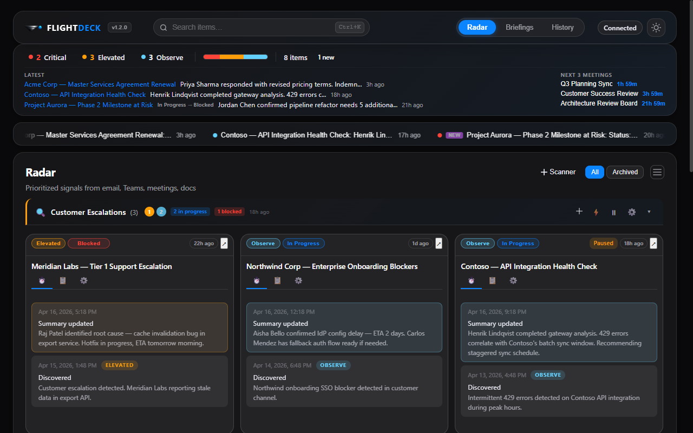

The dashboard is organized into three horizontal zones:

1. **Top bar** — App branding (with version badge), global search, tab navigation, theme toggle, and status pill
2. **KPI summary** — At-a-glance severity counts, severity distribution bar, and item totals
3. **Main content** — The active view's cards and details

---

## Navigation

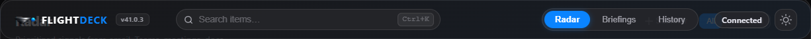

The top-right corner of the dashboard contains three main tabs:

| Tab | Purpose |
|-----|---------||
| **Radar** | All items — inbound signals and monitored tasks — organized by scanner, with inline tracking controls |
| **Briefings** | AI-generated meeting prep and daily briefings |
| **History** | Audit trail of every scan, update, and recommendation |

Click any tab to switch views. The active tab is highlighted with a colored background. To the right of the tabs, the **sun/moon icon** toggles between light and dark themes.

---

## KPI Summary Bar

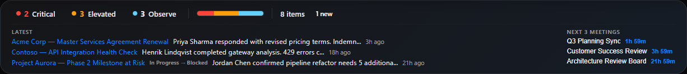

The KPI summary bar appears at the top of the main content area with at-a-glance metrics.

The bar shows three severity counters:

- **CRITICAL** (red) — Items that need action within 24 hours
- **ELEVATED** (yellow) — Items that need attention this week
- **OBSERVE** (blue) — Items on your watchlist, no immediate action needed

Next to the counters:

- **Severity distribution bar** — A color-coded horizontal bar showing the proportion of Critical (red), Elevated (yellow), and Observe (blue) items
- **Item total** — Total count of active items
- **Attention badges** — Quick counts of blocked, new, or completed items when present

---

## Radar View

The Radar is FlightDeck's primary view. It shows **all your items** — both inbound signals discovered by scanners and items you're actively monitoring — organized into collapsible sections grouped by scanner.


### Item Cards

Every item on the Radar — whether freshly discovered or actively monitored — appears as a card. Cards have a **header** strip and **three tabs** that organize all information and controls.

#### Card Header

The header strip across the top of every card contains:

- **Severity dropdown** — Click to change: `Critical` (red), `Elevated` (yellow), or `Observe` (blue). Sets the item's priority level and determines its position in the Radar sort order.
- **Lifecycle status dropdown** — Click to change: `In Progress`, `Blocked`, `Waiting`, `Snoozed`, `Complete`, or `Archived`. Tracks the item through its lifecycle. Setting an item to `Snoozed` adds a 💤 indicator with a relative countdown (e.g., "💤 2h left") showing when it will un-snooze.
- **Title** — A short descriptive title, editable inline (click to edit).
- **Status pills** (right side) — Contextual indicators that appear as needed:
  - **Paused** — Monitoring is disabled for this item
  - **NEW** — Item was discovered in the most recent scan and hasn't been seen yet
  - **UPDATED** (with count) — New changes detected since you last viewed the item (e.g., "UPDATED ×3")
  - **Relative time pill** — How long ago the last update occurred (e.g., "2h ago")
- **↗ Pop Out** — Opens the item in a dedicated window with item details on the left and full change history on the right

#### Activity Tab (⏱️)

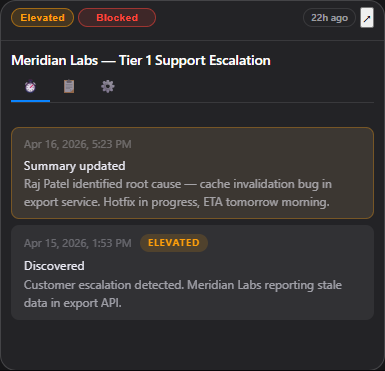

The Activity tab shows a chronological timeline of every change FlightDeck has detected for this item. Each entry in the timeline includes:

- **Timestamp** — When the change was detected
- **Severity badge** — The severity level at the time of that update
- **Changes description** — A structured summary of what changed (e.g., "Status: In Progress → Blocked" or "Links: +2 new")
- **Summary** — An AI-generated narrative of what happened and why it matters

Unseen entries are highlighted with a distinct background so you can immediately spot what's new. Click **Mark as Seen** to clear all unseen highlights and dismiss the NEW/UPDATED badge on the card header.

The card shows up to **3 recent entries** by default. Click the expand control to view the full history.

#### Overview Tab (📋)

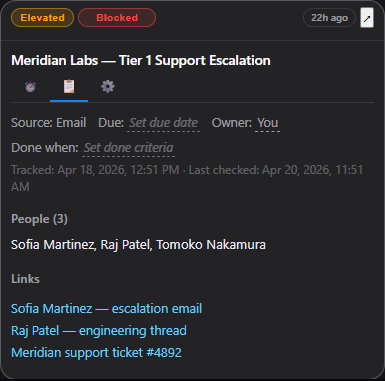

The Overview tab collects all metadata, context, and actionable information about the item:

- **Suggested next steps** — 0–2 concrete "WHO + WHAT" actions (e.g., "Reply to Sarah with the revised Q3 timeline"). Each step includes a **Draft ↗** button — click it to generate an AI-drafted message you can review, edit, and send.
- **Source** — Where the signal originated: Email, Chat, Meeting, or Doc.
- **Due date** — Editable inline. Click to open a date picker and set when action is needed. The AI automatically extracts due dates from temporal language in signals ("by Friday", "due March 1", "end of Q2"), but you can always override or clear the date manually.
- **Owner** — Editable inline. Who is responsible for this item.
- **Done when** — Editable inline. A free-text field where you define what "done" looks like for this specific item. For example: "Jordan confirms receipt of the budget spreadsheet" or "Contract signed by both parties." This criteria is automatically included in the monitoring prompt, so FlightDeck's AI knows exactly what resolution looks like and can detect when the item is complete. If you leave this blank, the AI uses its own judgment to assess completion.
- **People** — Collapsible list of counterparties and key contacts involved in this item.
- **Evidence links** — Clickable deep links back to source materials in M365, with recency labels showing when each signal was last updated (e.g., "3h ago", "yesterday").
- **Tracked / Last checked** — Timestamps showing when the item entered tracking and when the monitoring engine last ran a check.

#### Monitor Tab (⚙️)

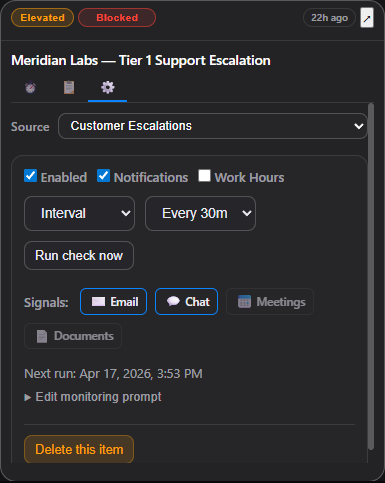

The Monitor tab gives you full control over how and when FlightDeck watches this item:

- **Source scanner** — Which scanner this item belongs to. You can move items between scanners if a different scanner's context is a better fit.
- **Schedule controls:**
  - **Enabled** checkbox — Master toggle for monitoring. Unchecking pauses all checks and shows a "Paused" pill on the card header.
  - **Notifications** checkbox — Whether to send desktop notifications when changes are detected.
  - **Work hours only** checkbox — Restrict interval-based checks to 8 AM – 5 PM. Only visible when the schedule type is set to Interval.
  - **Schedule type** dropdown:
    - **Interval** — Check on a recurring interval: every 15 minutes, 30 minutes, 1 hour, 2 hours, or 4 hours.
    - **Weekly** — Check on specific days of the week (Mon–Sun) at specific times. Defaults to weekdays at 8:00 AM and 12:00 PM. Click **+ Add** to add more time slots.
    - **One-time** — Check once at a specific date and time, then automatically disable monitoring.
  - **Next run** — Shows when the next scheduled check will fire.
  - **Run check now** — Trigger an immediate check without waiting for the schedule. Useful when you know something has changed and want instant results.
- **Signal filters** — Toggle which M365 sources to scan for this item: ✉️ Email, 💬 Chat, 📅 Meetings, 📄 Documents. Narrowing signals focuses the check and reduces noise — for example, turn off Documents for a purely email-based thread.
- **Edit monitoring prompt** — Expandable textarea showing the AI instructions used when checking this item. This prompt is auto-built from the item's title, summary, owner, people, source, and done criteria. You can customize it to add specific context, override defaults, or tune what the AI watches for.
- **Delete** — Remove this item from tracking entirely.

### Filter Bar

Above the item list, a filter bar lets you switch between:

- **All** — Shows all active items (excludes completed and archived)
- **Archived** — Shows completed and archived items (including items evicted to cold storage)

### Switching Between Card and List View

Click the **density toggle** button next to the filter bar to switch between the default **card view** (detailed cards) and **list view** (compact single-line rows).

### Scanners

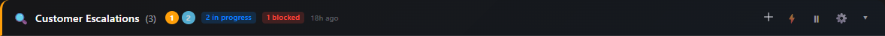

Scanners are the heart of FlightDeck's Radar. Each scanner is a named, scheduled AI scan that searches your M365 signals for specific topics. Items discovered by a scanner appear grouped under that scanner's section header.

Each scanner section header shows:

- **Scanner name and item count** — e.g., "My Scanner (12)"
- **Severity dots** — Quick counts of Critical, Elevated, and Observe items (clickable to filter)
- **Attention badges** — Counts of blocked or waiting items (clickable to filter)
- **New indicator** — Count of new or recently updated items (clickable to filter)
- **Next run countdown** — Time until the scanner runs again (e.g., "⏱ 12m")
- **Action buttons** — Add item (+), run scan now (⚡), pause/resume (⏸/▶), settings (⚙️), collapse/expand (▾)

Click any severity dot, attention badge, or "new" indicator to filter that scanner's items inline. Click ✕ to clear the filter.

### Adding a Scanner

Click the **+ Scanner** button at the top of the Radar view to create a new scanner.

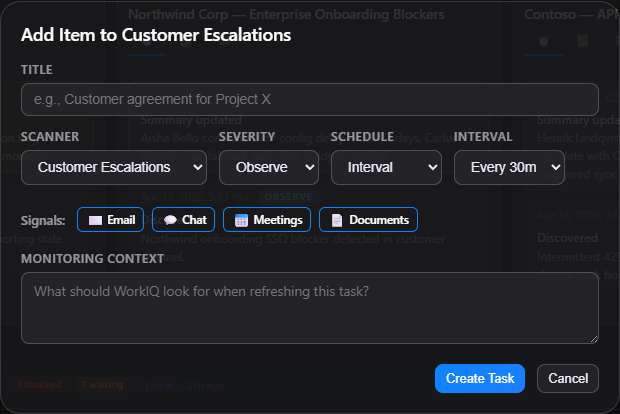

The scanner settings modal opens with:

| Field | Description |
|-------|-------------|
| **Name** | A descriptive label (e.g., "Competitor Intel", "Project X Updates") |
| **Schedule** | How often to scan: Interval (15m–4h), Scheduled (specific days/times), or One-time |
| **Prompt** | The AI instructions — tell it what signals to look for. Use `{lastRunAt}` for time-based filtering. |

Additional options include:

- **Signal types** — Which M365 sources to scan (Email, Chat, Meetings, Documents)
- **Work hours only** — Restrict scans to 8 AM – 5 PM
- **Run on startup** — Automatically run this scanner when FlightDeck launches
- **Missed run policy** — What to do when a scheduled scan was missed: skip, run once, or catch up (max 3)
- **Auto-monitor new items** — Automatically enable monitoring on newly discovered items
- **Notification mode** — All notifications, critical-only, or silent
- **Max items per scan** — Cap on how many items a single scan returns (1–25, default 10)
- **Dedup strategy** — How to detect duplicate items: by evidence URL, title similarity, or both
- **Cross-scanner dedup** — Whether to check for duplicates across all scanners
- **Exclude keywords** — Filter out items matching specific keywords
- **Auto-archive** — Automatically archive items after a set number of days
- **Retention** — How long to keep items before eviction (up to 365 days)
- **Webhook URL** — POST scan results to an external URL

### Scanner Settings

To edit an existing scanner's settings, click the **⚙️ gear icon** in that scanner's section header.

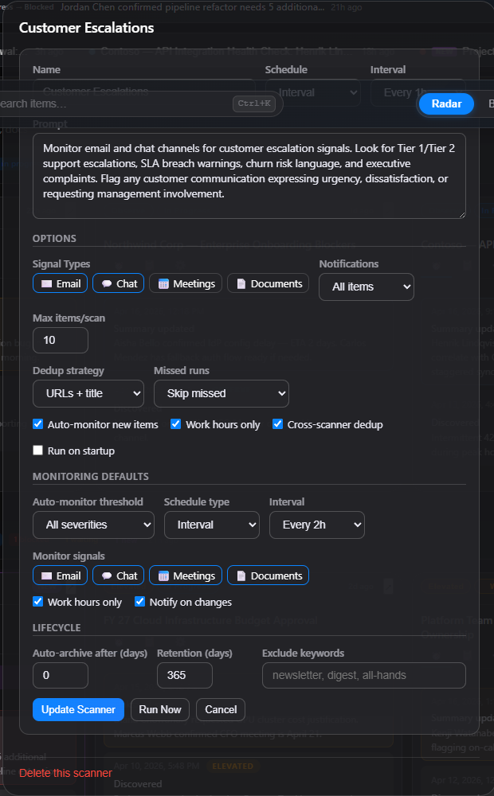

This opens the scanner settings modal where you can modify any of the options described above.

You can also:

- **Pause/resume** a scanner using the ⏸/▶ button in the section header
- **Run a scan immediately** using the ⚡ button
- **Delete a scanner** from the settings modal (items with completed/archived status are preserved)

### Scanner Examples

Not sure what to put in the prompt field? Here are ten ready-to-use scanner prompts organized from simple to advanced. Copy any prompt into a new scanner, adjust the settings, and you're scanning in under a minute.

Every scanner prompt builds on the same base template — you only write the **"Focus specifically on"** part. The template already handles time filtering (`{lastRunAt}`), citation rules, and due-date extraction.

---

#### Starter Examples

These prompts are short, focused, and a great first scanner to set up.

**Deadline Watchdog** — Catches upcoming deadlines mentioned across email, chats, and meetings so nothing sneaks past you.

**Prompt:**

> Focus specifically on: any deadlines, due dates, or time-sensitive commitments involving me — whether I set them or someone else did. Include items where a deadline is implied ("by end of week", "before the board meeting"). Classify as Critical if the deadline is within 48 hours, Elevated if within 7 days, Observe otherwise.

**Settings:** Schedule every 2 h · All signal types · Auto-monitor on · Max 10 items

💡 **Tip:** Pair this with a Scheduled run at 8 AM on Mondays to catch week-ahead deadlines in your morning routine.

---

**Action Items I Owe** — Finds commitments you made in meetings and chats — the stuff that slips through the cracks.

**Prompt:**

> Focus specifically on: action items, commitments, or promises that **I** made to others. Look for phrases like "I'll handle", "I'll send", "let me follow up", "I owe you", or any task I volunteered for. Do NOT surface items that others owe me — only things I need to deliver. Include the person I committed to and any stated or implied deadline.

**Settings:** Schedule every 4 h · Chat + Meetings signals · Max 10 items

💡 **Tip:** Turn on auto-monitor so FlightDeck keeps watching each commitment until you mark it complete.

---

**1:1 Prep Scanner** — Auto-generates talking points for your next 1:1 by scanning recent signals involving that person.

**Prompt:**

> Focus specifically on: any topics, updates, open questions, or unresolved threads involving my direct manager. Include status changes on shared projects, decisions that need alignment, blockers I should raise, and any praise or wins worth mentioning. Group by theme (updates, blockers, asks, wins).

**Settings:** Weekly, day before your 1:1 · All signal types · Max 8 items

💡 **Tip:** Swap "my direct manager" for a specific name. Duplicate this scanner for each person you have regular 1:1s with.

---

#### Intermediate Examples

These prompts use multi-signal filtering, negative instructions, and severity hints for more targeted scanning.

**Team Health Signals** — Monitors for burnout, overload, or morale signals from your direct reports. Built for managers.

**Prompt:**

> Focus specifically on: signals that indicate team health issues among my direct reports:
> - Late-night or weekend messages (potential overload)
> - Requests to reschedule or cancel 1:1s repeatedly
> - Language suggesting frustration, burnout, or disengagement ("swamped", "drowning", "can't keep up")
> - Missed deadlines or slipping commitments
> - Escalations or complaints from stakeholders about a report's work
>
> Do NOT surface routine status updates or normal work activity. Only flag patterns that suggest someone may need support. Classify as Critical if multiple signals appear for the same person, Elevated for isolated signals.

**Settings:** Schedule every 4 h · Email + Chat signals · Work hours only · Max 8 items · Critical-only notifications

💡 **Tip:** Set notifications to critical-only — you don't want a firehose, just early warning signs worth a check-in.

---

**Decisions That Affect My Work** — Catches decisions made in meetings you weren't in, so you're never blindsided. Built for ICs.

**Prompt:**

> Focus specifically on: decisions, approvals, direction changes, or priority shifts discussed in meetings I did NOT attend. Look for signals like "we decided", "leadership approved", "we're pivoting", "new priority", or "effective immediately" in meeting recaps, follow-up emails, and chat threads. Include who made the decision and what changed. Do NOT include meetings I attended — only information I might have missed.

**Settings:** Schedule every 2 h · Meetings + Email + Chat signals · Max 10 items

💡 **Tip:** Add exclude keywords for recurring meetings you always attend (e.g., your own team standup) to reduce noise.

---

**Sales Deal Radar** — Tracks deal momentum, buying signals, and competitor mentions across your pipeline.

**Prompt:**

> Focus specifically on: signals related to active sales opportunities:
> - Buying signals — budget approvals, executive sponsor engagement, procurement involvement, timeline discussions
> - Risk signals — going silent, postponed meetings, reduced stakeholder engagement, mentions of competing vendors
> - Competitor mentions — any reference to competing products or vendors by name in customer communications
> - Deal progression — contract redlines, legal review, POC feedback, reference requests
>
> Classify as Critical if a deal shows risk signals or competitor activity. Classify as Elevated for positive buying signals that need follow-up. Include the account/deal name and the specific signal detected.

**Settings:** Schedule every 1 h · Email + Chat signals · Max 15 items · Auto-monitor on

💡 **Tip:** Increase max items to 15 if you're managing 10+ active deals to make sure nothing gets clipped.

---

**Engineering Incident Monitor** — Surfaces P0/P1 alerts, production issues, and outage signals so you can respond fast.

**Prompt:**

> Focus specifically on: production incidents, outage signals, and high-severity engineering alerts:
> - P0/P1/Sev1/Sev2 mentions in any channel
> - Keywords: "outage", "incident", "degraded", "rollback", "hotfix", "pages", "on-call"
> - Customer-reported issues escalated to engineering
> - Post-incident review or retrospective scheduling
>
> Classify as Critical if the incident is active or unresolved. Classify as Elevated for post-incident follow-ups. Do NOT surface routine deployments, feature releases, or low-severity bugs.

**Settings:** Schedule every 30 m · Email + Chat signals · All notifications · Max 10 items · Run on startup

💡 **Tip:** Enable "Run on startup" so you immediately know about any incidents that fired overnight.

---

#### Advanced Examples

These prompts use multi-section extraction, structured severity classification, and complex filtering for power users.

**Executive Briefing Scanner** — Multi-section strategic scanner that surfaces risk, opportunity, and competitive intel for senior leaders.

**Prompt:**

> Focus specifically on: executive-level intelligence across these categories:
>
> **Strategic risks:**
> - Escalations reaching VP+ level
> - Budget or headcount changes
> - Key personnel departures or re-orgs
> - Customer churn signals or major account issues
>
> **Opportunities:**
> - New partnership or expansion discussions
> - Positive customer feedback or case study candidates
> - Cross-sell or upsell signals from existing accounts
>
> **Competitive intelligence:**
> - Competitor mentions in customer conversations
> - Win/loss signals and reasons cited
> - Market or analyst report references
>
> **Organizational signals:**
> - Cross-functional alignment issues
> - Recurring meeting cancellations at leadership level
> - Strategy or priority shifts signaled in all-hands or leadership threads
>
> Classify as Critical if a risk could impact quarterly targets or requires immediate executive attention. Classify as Elevated for opportunities with a time window. For each item, include the source, key people involved, and a one-line recommended action.

**Settings:** Weekly, 7 AM weekdays · All signal types · Max 15 items · Critical-only notifications

💡 **Tip:** Schedule this once per morning rather than on an interval — executive-level signals don't need real-time polling, and a daily digest is easier to act on.

---

**Compliance & Audit Watch** — Tracks regulatory deadlines, audit findings, policy changes, and vendor certification status.

**Prompt:**

> Focus specifically on: compliance, regulatory, and audit-related signals:
> - Upcoming regulatory deadlines or filing dates
> - Audit findings, action items, or remediation tracking
> - Policy changes or new compliance requirements
> - Vendor/third-party certification renewals or expirations
> - Data privacy requests (DSAR, GDPR, CCPA) and response deadlines
> - Internal control review results or exceptions
>
> Classify as Critical if a deadline is within 7 days or an audit finding is unresolved. Classify as Elevated for items within 30 days. Do NOT surface general legal discussions, routine contract renewals without compliance implications, or HR policy changes unrelated to regulatory requirements. Include the specific regulation, deadline, or finding reference where available.

**Settings:** Schedule every 4 h · Email + Documents signals · Auto-monitor on · Retention 365 days · Max 10 items

💡 **Tip:** Set retention to the maximum (365 days) — compliance items often have long timelines and you'll want the full audit trail.

---

**Cross-Team Dependency Tracker** — Structured extraction of inter-team blockers, handoffs, and delivery commitments.

**Prompt:**

> Focus specifically on: cross-team dependencies and inter-team coordination signals:
> - Deliverables my team is waiting on from other teams (and their stated timelines)
> - Deliverables other teams are waiting on from us
> - Blocked work items where the blocker is owned by another team
> - Handoff requests, API contract changes, or shared resource conflicts
> - Escalations about missed cross-team commitments
>
> For each item, extract:
> - **Dependency direction:** "We need from [Team]" or "[Team] needs from us"
> - **What:** The specific deliverable or blocker
> - **Deadline:** Any stated or implied timeline
> - **Status:** On track, at risk, or blocked
>
> Classify as Critical if a dependency is blocked or the deadline is within 3 days. Classify as Elevated if at risk or within 2 weeks. Do NOT include internal team tasks with no cross-team component.

**Settings:** Schedule every 2 h · All signal types · Auto-monitor on · Max 12 items

💡 **Tip:** Duplicate this scanner and customize one per partner team if you have complex multi-team dependencies — the cross-scanner dedup will prevent overlapping items automatically.

---

### Prompt Writing Tips

Getting the most out of your scanners comes down to writing clear, specific prompts. Here are practical tips to level up your scanner results.

1. **Be specific about what "actionable" means.** Don't just say "find important emails." Tell the scanner what makes something actionable: a deadline, a decision needed, a commitment made, a risk detected. The more concrete your criteria, the fewer false positives you'll get.

2. **Use bullet lists for multi-signal prompts.** When you're scanning for several types of signals, break them into a bulleted list inside the prompt. The AI handles structured lists better than run-on paragraphs, and it makes your prompt easier to edit later.

3. **Tell the AI what to ignore.** Negative instructions ("Do NOT surface routine status updates") are just as valuable as positive ones. Without them, you'll get flooded with technically-relevant-but-not-useful items. Be explicit about what's noise for your use case.

4. **Teach severity by example.** Rather than leaving severity classification to the AI's judgment, include concrete rules: "Classify as Critical if the deadline is within 48 hours" or "Classify as Elevated if a competitor is mentioned." This makes severity consistent across scans and makes the KPI bar meaningful.

5. **Match schedule frequency to urgency.** A production incident scanner should run every 30 minutes. A compliance scanner can run every 4 hours. An executive briefing works best as a once-daily scheduled run. Don't waste scan cycles on signals that don't change fast.

6. **Start simple, then layer on.** Your first version of a scanner prompt should be 2–3 lines. Run it a few times, see what comes back, then add negative instructions, severity rules, or additional signal categories. Prompt iteration beats prompt perfection.

7. **Pick the right signal types.** Not every scanner needs all four signal types (Email, Chat, Meetings, Documents). An incident monitor probably doesn't need Documents. A compliance scanner probably doesn't need Chat. Narrowing signal types reduces noise and speeds up scans.

### Tracked Items & Monitoring

Tracking is how you tell FlightDeck "keep watching this." Any item on the Radar can be promoted from a one-time signal to an actively monitored item. Once tracked, FlightDeck periodically re-scans that item's M365 sources and notifies you when something meaningful changes — a status shift, a new reply, an approaching deadline, or resolution of your "done" criteria.

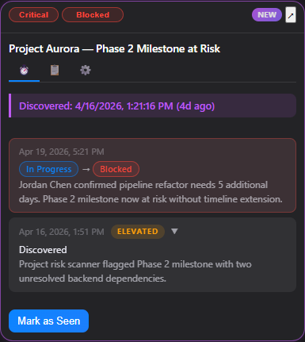

**How to track an item:**

- **From a scan result** — Click the **Track Item** button on any card. FlightDeck enables monitoring with sensible defaults (interval schedule, all signal types, auto-generated monitoring prompt).
- **Custom item** — Click the **+** button in any scanner's section header to create a tracked item from scratch. Fill in a title, severity, and monitoring prompt to start watching something specific that scanners haven't discovered yet.

**Tracked item badges:**

- **NEW** — This item was discovered for the first time in the most recent scan. It hasn't been viewed yet.
- **UPDATED** (with count) — FlightDeck has detected meaningful changes since you last viewed the item. The count shows how many new updates are waiting (e.g., "UPDATED ×3").

Tracked items use the same three-tab card layout — **Activity** (⏱️), **Overview** (📋), and **Monitor** (⚙️) — documented in detail in the [Item Cards](#item-cards) section above. The Overview tab is where you set **due dates** and **done criteria** that guide monitoring, and the Monitor tab is where you configure schedules, signal filters, and the monitoring prompt.

### Change History

Each monitored item maintains a **Change History** — a log of every meaningful change detected over time. Click **▸ Change History** to expand it.

Each entry includes:

- **Timestamp** — When the change was detected
- **Status transition** — What changed (e.g., "Status: Negotiation → Under Review · Links: +1 new")
- **Summary** — AI-generated description of what happened
- **Source link** — Clickable link to the original signal in M365
- **Suggested next step** — Recommended action based on the change

The most recent changes appear at the top. Entries are de-duplicated — the monitoring engine includes previous summaries in each check to avoid re-reporting the same information.

### Lifecycle Statuses

Every item has a lifecycle status that reflects its current state:

| Status | Meaning |
|--------|---------|
| **In Progress** | Active item being monitored or worked |
| **Blocked** | Item is stalled — detected automatically from AI status reports |
| **Waiting** | Pending external input or a response |
| **Snoozed** | Temporarily hidden; auto-un-snoozes when the snooze period expires |
| **Complete** | Resolved — monitoring auto-disables. Item moves to the Archived filter. |
| **Archived** | Manually or auto-archived. Preserved in cold storage for reference. |

Lifecycle transitions can happen automatically based on AI analysis (e.g., an item marked "resolved" by the AI is auto-completed) or manually via item actions.

### Automatic Status Detection

FlightDeck doesn't just track items — it triages them for you. Each time the monitoring AI checks an item, it analyzes the latest signals and automatically updates the lifecycle status based on what it finds:

- **Blocked** — If the AI detects language like "stalled," "blocked," or "waiting on a dependency," the item moves from In Progress to Blocked.
- **Waiting** — If signals indicate the ball is in someone else's court — "pending review," "awaiting response" — the status shifts to Waiting.
- **Complete** — When the AI sees "resolved," "completed," or "closed" — or when your **Done when** criteria are met — the item is marked Complete, monitoring is automatically disabled, and a completion timestamp is recorded.

You can always override a status manually, but in most cases FlightDeck handles it before you even check. The **triage progress bar** on the dashboard shows how many of your active items have been reviewed, so you can tell at a glance whether anything still needs your attention.

### Done Criteria

The **Done when** field on the Overview tab lets you define what "finished" looks like for each item — for example, *"Jordan confirms receipt of the budget spreadsheet"* or *"Contract signed by both parties."* This text is automatically woven into every monitoring prompt, so the AI actively watches for signals that match your criteria and marks the item complete when they appear.

---


---

## Briefings View

The Briefings view generates **AI-powered meeting preparation** for your upcoming meetings and a daily overview to start your day. When you switch to the Briefings tab for the first time in a session, FlightDeck automatically fetches your meetings if they haven't been loaded yet.

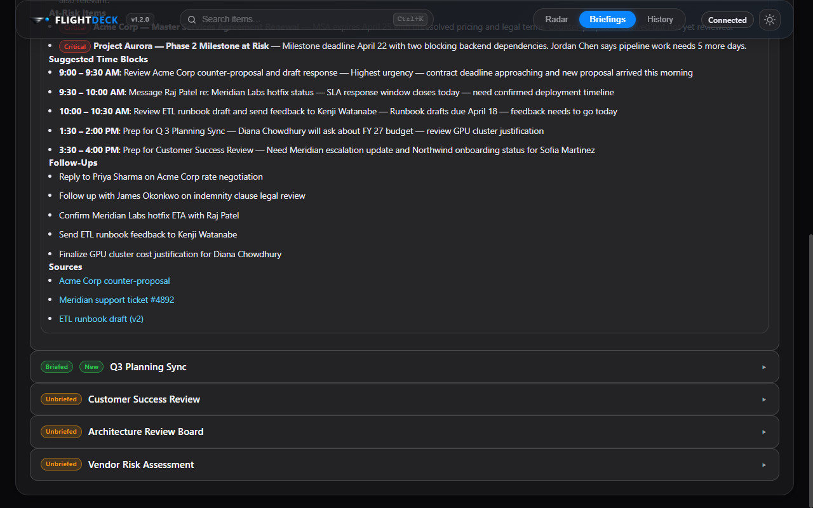

### My Day Briefing

At the top of the Briefings view, the **My Day** briefing gives you a comprehensive daily overview. It's marked with a ☀️ icon and generates automatically. The briefing includes:

- **Headline** — A one-line summary of your day (e.g., "Busy day: 4 meetings, 2 Critical items need attention")
- **Top Priorities** — The most important things to address today, with specific names and actions
- **Meetings Requiring Prep** — Meetings that have complex agendas or potential risks, with context
- **At-Risk Items** — Critical-severity items that could escalate, with red `Critical` badges
- **Suggested Time Blocks** — AI-recommended schedule showing what to work on and when (e.g., "8:00 – 8:30 AM: Review Contoso escalation telemetry")
- **Follow-Ups** — Actions to take after meetings or deadlines

Click **Regenerate My Day** to get a fresh briefing based on the latest data.

### Meeting Briefings

Below My Day, each upcoming meeting appears as a collapsible row with:

- **Status badge** — `Briefed` (green) if a briefing has been generated, or `Unbriefed` (orange) if not
- **New badge** — Orange `New` label if the briefing was recently generated
- **Meeting title** — Name of the meeting

Click a meeting row to expand it and see the full briefing.


### Meeting Briefing Content

An expanded meeting briefing contains:

- **Meeting metadata** — Date/time, organizer, and a clickable **join meeting** link
- **Regenerate Briefing** button — Regenerate the briefing fresh
- **Headline** — AI-generated summary of the meeting's context and key tension points
- **Key Updates** — Bullet points on what happened since the last meeting, with specific people and facts
- **Decisions Needed** — Choices that must be made, with tradeoffs outlined
- **Top Risks** — What could go wrong if action isn't taken
- **Talk Track** — Suggested talking points and how to approach the discussion
- **Follow-Ups** — Post-meeting actions to take
- **Sources** — Clickable links back to the meetings, documents, chats, and emails that informed the briefing

### Editing the Briefing Prompt

Click **▸ Edit Briefing Prompt** to customize the AI instructions used to generate meeting briefings. You can adjust what the AI emphasizes, the level of detail, or the tone.

---

## History View

The History view is a chronological **audit trail** of everything FlightDeck has done — every scan, every recommendation, and every system event.

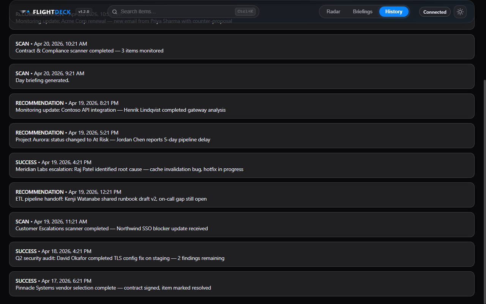

### Event Types

Each history entry is color-coded by type:

| Event | Description |
|-------|-------------|
| **STARTUP** | FlightDeck initialized or was restarted |
| **SCAN** | A monitoring cycle completed — shows what was checked and whether new information was found |
| **RECOMMENDATION** | The AI generated a briefing or recommended an action |

### History Entry Details

Each entry shows:

- **Event type and timestamp** — e.g., "SCAN · 3/2/2026, 7:00:00 AM"
- **Summary** — What happened during this event
- **Links** — When a scan detects changes, it shows the relevant source link (clickable, opens in M365)

The History view is read-only — it's a complete log that lets you understand the timeline of signals, scans, and recommendations.

---

## Search

FlightDeck includes a **global search** that works across all views.

- Press **Ctrl+K** (or click the search bar at the top) to activate search
- Type your query to instantly filter across radar items, tracked tasks, and briefings
- Results highlight matching text and show the item type (radar, tracker, or briefing)
- Click a result to jump to that item in its respective view

Search uses fuzzy matching — you don't need an exact match. Multi-word queries match when all words appear somewhere in the item.

---

## Version Notifications

FlightDeck checks for updates on startup. When a newer version is available:

- An **update indicator** (pulsing dot) appears next to the version badge in the top bar
- Hover to see the available version and a **View release ↗** link to the release page
- Click **×** to dismiss the notification for that version — it won't reappear until a newer version is released

---

## Theme

FlightDeck supports **dark** and **light** themes:

- Click the **sun/moon icon** in the top-right corner to toggle between themes
- By default, FlightDeck follows your system preference (Windows dark/light mode)
- Once you manually toggle, your choice is remembered across sessions

---

## System Tray

FlightDeck runs in the **system tray** when minimized:

- Close the window to minimize to tray (FlightDeck keeps running in the background)
- Monitoring schedules continue — you'll receive **desktop notifications** when tracked items have meaningful changes
- Click the tray icon to restore the window
- Right-click the tray icon for options

---

## Demo Mode

FlightDeck includes a demo mode for presentations, screenshots, and exploring the app without a Microsoft 365 connection.

### Running in Demo Mode

```bash
npm run demo          # Launch with sample data (cached between runs)
npm run demo:reseed   # Launch with fresh sample data (always resets)
```

Demo mode:
- Loads realistic sample data (9 items across 3 scanners, meetings, briefings, history)
- **Never calls WorkIQ** — all AI features are disabled, no M365 connection needed
- Uses a separate data store (`flightdeck.demo.v2`) — your real data is never touched
- Dates adjust automatically so the demo always looks current

### Automated Screenshots

```bash
npm run screenshots   # Capture all views in dark + light themes
```

Screenshots are saved to `docs/screenshots/` — useful for documentation, presentations, and README images.

---

## Keyboard Shortcuts

| Shortcut | Action |
|----------|--------|
| **Ctrl+K** | Open global search |
| **Ctrl+R** | Refresh current view |
| **Esc** | Close search / dismiss popups |

---

## Tips & Best Practices

1. **Set up your scanners** — Create scanners for the topics you care about most. Each scanner runs on its own schedule and surfaces relevant signals automatically.

2. **Track what matters** — When you see an item that needs ongoing attention, click **Track Item**. FlightDeck will continuously monitor it and flag changes.

3. **Use Briefings before meetings** — Expand a meeting briefing 10–15 minutes before the call. The AI pulls context from related emails, chats, and documents so you walk in prepared.

4. **Start your day with My Day** — The daily briefing gives you a prioritized view of your day with suggested time blocks.

5. **Mark as Seen** — When you've reviewed a tracked item's update, mark it as seen. This keeps your dashboard clean and makes it easy to spot genuinely new updates.

6. **Pop out for focus** — Use the **↗ Pop Out** button to open a tracked item in its own window. This is useful when you need to reference it while working in another app.

7. **Customize your prompts** — Edit scanner prompts via the ⚙️ settings button to tailor what the AI looks for. Edit the briefing prompt to adjust meeting prep style.

8. **Use scanner filters** — Click the severity dots, attention badges, or "new" indicator in a scanner header to quickly filter items without leaving the Radar.

9. **Check History for context** — If you're unsure when something changed or what triggered a recommendation, the History view has the full timeline.

10. **Let auto-monitor work for you** — Enable "Auto-monitor new items" in scanner settings so newly discovered items are automatically tracked without manual action.
