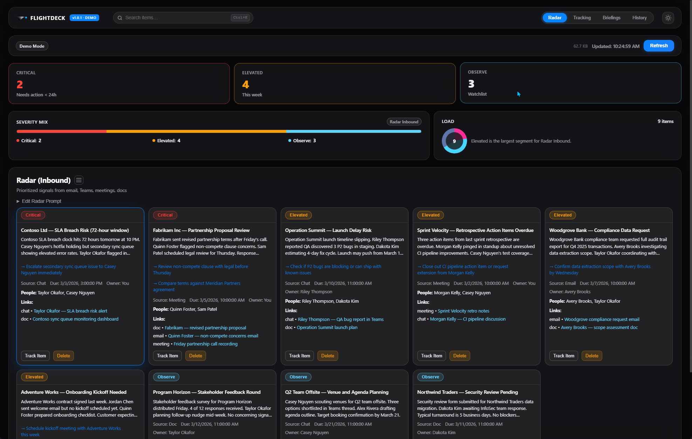
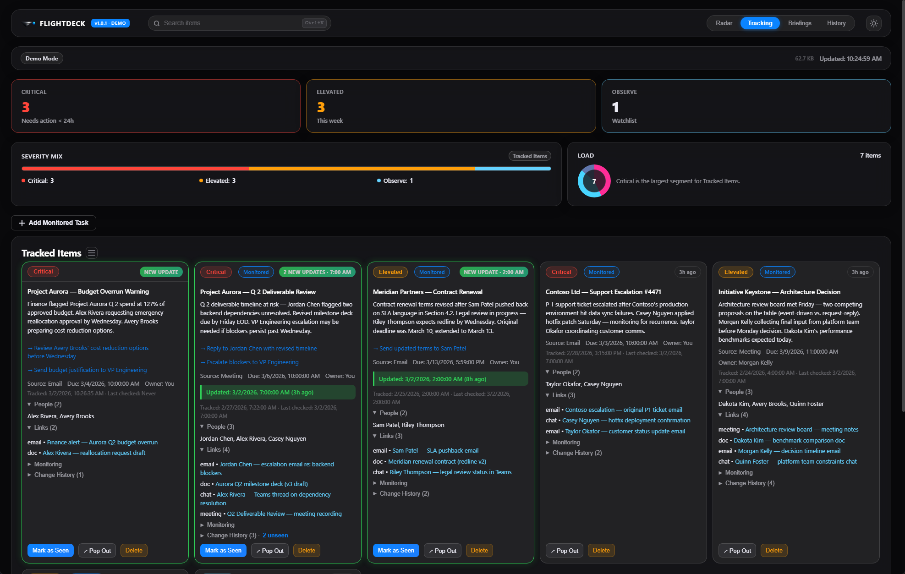
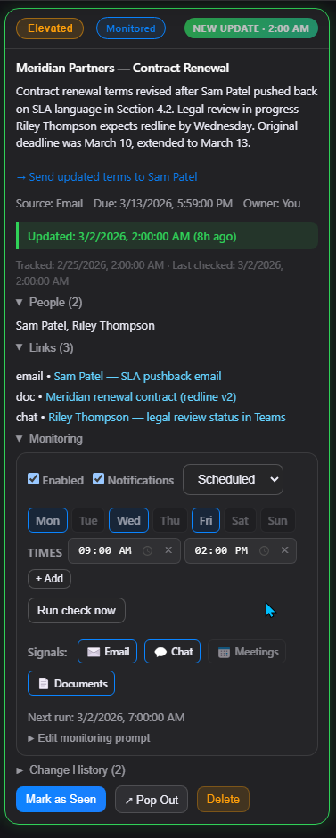
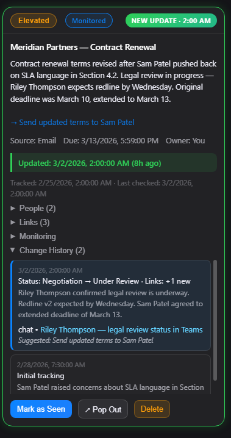
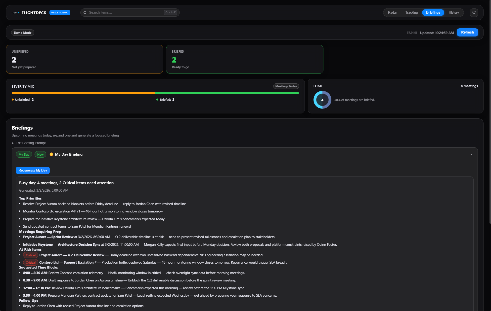
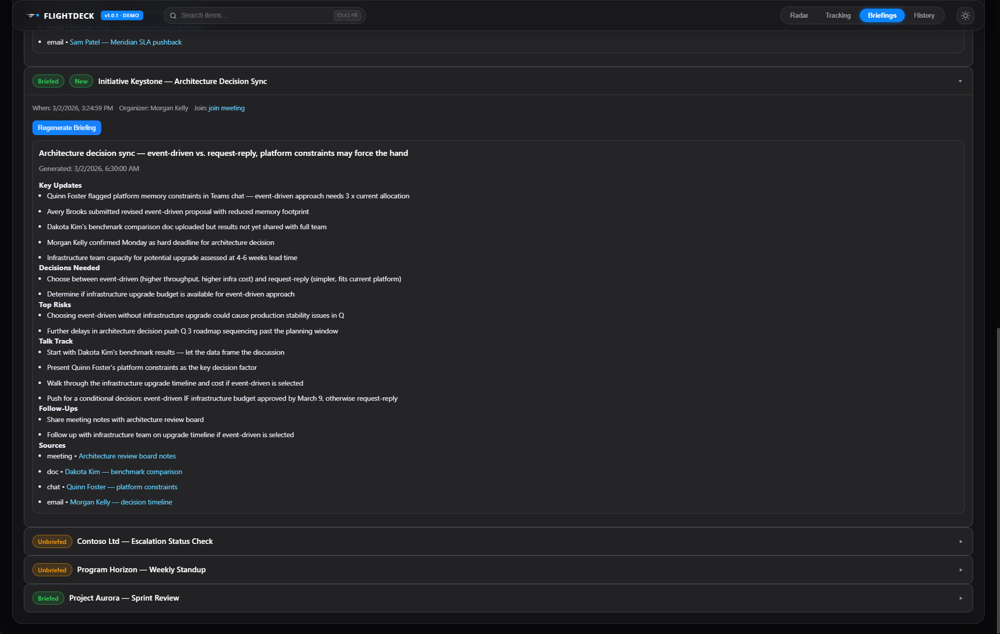
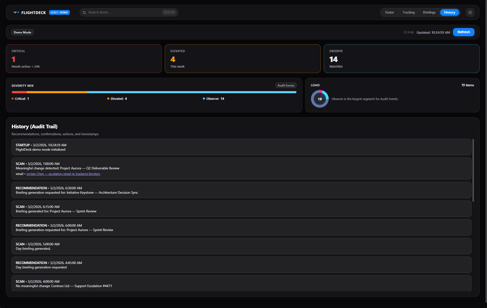

# FlightDeck User Guide

FlightDeck is a personal work-intelligence dashboard that connects to Microsoft 365 via the WorkIQ CLI. It scans your email, Teams chats, meetings, and documents, then surfaces the items that need your attention — ranked by urgency. Think of it as air traffic control for your workload.

---

## Table of Contents

- [First Launch](#first-launch)
- [Dashboard Overview](#dashboard-overview)
- [Navigation](#navigation)
- [KPI Summary Bar](#kpi-summary-bar)
- [Radar View](#radar-view)
- [Tracking View](#tracking-view)
  - [Change History](#change-history)
  - [Monitoring & Scheduling](#monitoring--scheduling)
- [Briefings View](#briefings-view)
- [History View](#history-view)
- [Search](#search)
- [Theme](#theme)
- [System Tray](#system-tray)
- [Keyboard Shortcuts](#keyboard-shortcuts)

---

## First Launch

When you open FlightDeck for the first time, here's what happens:

> **No manual EULA step needed.** FlightDeck automatically accepts the WorkIQ EULA when you click "Enable WorkIQ". You do **not** need to run `workiq accept-eula` in a terminal first — the app handles it for you.

1. **You land on the Radar tab** — This is the default view every time you open the app.
2. **The Connect banner appears** — At the top of the main area, you'll see a banner that says *"Connect: Requires Node.js, Copilot license, and tenant admin consent for WorkIQ data access."* with an **Enable WorkIQ** button.
3. **Click "Enable WorkIQ"** — This is the key step! FlightDeck will:
   - **Auto-accept the WorkIQ EULA** (handles Y/N prompts automatically)
   - **Run a health check** to verify your WorkIQ connection (status shows "Checking WorkIQ...")
   - If the EULA acceptance or health check fails, you'll see an error message with guidance
4. **Automatic first refresh** — Once connected, FlightDeck immediately runs a full refresh in parallel:
   - **Radar scan** — The AI scans your M365 signals (email, Teams, meetings, documents) and populates the Radar with prioritized items.
   - **Meetings refresh** — FlightDeck pulls your upcoming meetings for today and populates the Briefings view.
5. **Briefings are ready** — Switch to the Briefings tab and you'll see your meetings listed. Expand any meeting to generate a briefing, or click **Regenerate My Day** for your daily overview.
6. **Start tracking** — As you review Radar items, click **Track Item** on anything that needs ongoing monitoring. FlightDeck will watch it on a schedule and notify you of changes.

On subsequent launches, if you were previously connected, FlightDeck automatically verifies the connection and runs a full refresh — you'll see your Radar and Meetings update within seconds of opening the app. If the connection check fails (e.g., WorkIQ CLI isn't available), the Connect banner reappears.

> **Tip:** FlightDeck remembers your connection state, tracked items, and monitoring schedules in local storage. Your data persists across sessions.

> **EULA re-acceptance:** If the WorkIQ EULA needs to be re-accepted (e.g., after a WorkIQ reinstall or update), FlightDeck will automatically detect it. The "Enable WorkIQ" banner will reappear so you can click it to re-accept — no manual terminal commands needed.

---

## Dashboard Overview

When you launch FlightDeck, you'll see the main dashboard with four tabs: **Radar**, **Tracking**, **Briefings**, and **History**. The active tab is highlighted in the top navigation bar.

The dashboard is organized into three horizontal zones:

1. **Top bar** — App branding, global search, tab navigation, and settings
2. **KPI summary** — At-a-glance severity counts, severity mix bar, and load indicator
3. **Main content** — The active view's cards and details

---

## Navigation

The top-right corner of the dashboard contains the four main tabs:

| Tab | Purpose |
|-----|---------|
| **Radar** | Inbound signals from M365, prioritized by AI |
| **Tracking** | Items you've chosen to actively monitor over time |
| **Briefings** | AI-generated meeting prep and daily briefings |
| **History** | Audit trail of every scan, update, and recommendation |

Click any tab to switch views. The active tab is highlighted with a colored background. To the right of the tabs, the **gear icon** (⚙️) toggles between light and dark themes.

---

## KPI Summary Bar

Every view shows a KPI summary bar at the top with metrics relevant to the active view.

### Radar & Tracking KPIs

The KPI bar shows three severity counters:

- **CRITICAL** (red border) — Items that need action within 24 hours
- **ELEVATED** (yellow border) — Items that need attention this week
- **OBSERVE** (blue border) — Items on your watchlist, no immediate action needed

Below the counters:

- **Severity Mix** — A color-coded horizontal bar showing the proportion of Critical (red), Elevated (yellow), and Observe (blue) items. A label in the center shows the view type (e.g., "Radar Inbound" or "Tracked Items").
- **Load** — A donut chart showing total item count with a note about which segment is largest.

### Briefings KPIs

The Briefings view shows different counters:

- **UNBRIEFED** (red border) — Meetings that don't have a generated briefing yet
- **BRIEFED** (green border) — Meetings with briefings ready to go
- **Load** — Donut chart showing total meetings and the percentage that are briefed

---

## Radar View

The Radar is FlightDeck's primary view. It shows **inbound signals** that the AI has identified as needing your attention, sourced from your email, Teams messages, meetings, and documents.

### Radar Cards

Each radar item appears as a card with:

- **Severity badge** — Color-coded label: `Critical` (red), `Elevated` (yellow), or `Observe` (blue)
- **Title** — A short descriptive title (e.g., "Contoso Ltd — SLA Breach Risk (72-hour window)")
- **Summary** — AI-generated description of why this item was surfaced
- **Suggested next steps** — Actionable recommendations shown as blue links (e.g., "→ Escalate secondary sync queue issue to Casey Nguyen immediately")
- **Source** — Where the signal came from (Email, Chat, Meeting, or Doc) and when
- **Owner** — Who the item is attributed to
- **People** — Key contacts involved
- **Links** — Clickable links back to the original source materials in M365 (emails, chats, documents, meetings)

### Radar Actions

At the bottom of each radar card, you'll find two buttons:

- **Track Item** — Promotes the radar item to the Tracking view for ongoing monitoring. FlightDeck will periodically re-scan this item and notify you of meaningful changes.
- **Delete** — Removes the item from the radar.

### Refreshing the Radar

Click the **Refresh** button (top-right, red) to trigger a new AI-powered scan of your M365 signals. The "Updated:" timestamp shows when data was last refreshed.

### Switching Between Card and List View

Click the **view toggle** (☰) next to "Radar (Inbound)" to switch between the default **card view** (detailed cards in a grid) and **list view** (compact single-line rows).

### Editing the Radar Prompt

Click **▸ Edit Radar Prompt** (below the section title) to expand the prompt editor. This lets you customize the instructions sent to the AI when scanning your signals. You can tailor what the AI looks for, how it prioritizes, or what sources to emphasize.

---

## Tracking View

The Tracking view shows items you've chosen to actively monitor. Unlike the Radar (which is a snapshot of inbound signals), tracked items are **continuously monitored** — FlightDeck periodically re-checks them and alerts you when something meaningful changes.

### Tracked Item Cards

Tracked items have richer detail than radar cards:

- **Severity badge** — Same color-coded system as Radar
- **Monitored badge** — Green label indicating this item is being actively watched
- **NEW UPDATE badge** — Orange label that appears when FlightDeck detects a meaningful change, with a timestamp (e.g., "NEW UPDATE · 2:00 AM"). Items with new updates are highlighted with a green left border.
- **Time badges** — Gray labels showing how recently the item was last checked (e.g., "3h ago")
- **Title & summary** — Same as Radar, but the summary updates as the situation evolves
- **Suggested next steps** — Updated action recommendations shown as clickable blue links. On tracked items, clicking a suggestion generates an **AI-drafted message** via WorkIQ and opens it in a preview window, ready to send.
- **Source, date, and owner** — Metadata about the signal's origin
- **Updated timestamp** — A highlighted yellow bar showing when the last meaningful change was detected (e.g., "Updated: 3/2/2026, 7:00:00 AM (3h ago)")
- **Tracking timeline** — Shows when the item was first tracked and when it was last checked
- **People** — Collapsible list of all contacts involved (click ▸ to expand)
- **Links** — Collapsible list of all related source links in M365 (emails, docs, chats, meetings)
- **Monitoring** — Collapsible section with scheduling controls, signal filters, and notification settings (see [Monitoring & Scheduling](#monitoring--scheduling) below)
- **Change History** — Collapsible log of all detected changes over time with entry count and unseen count (see [Change History](#change-history) below)

### Change History

Each tracked item maintains a **Change History** — a log of every meaningful change detected by FlightDeck over time. Click **▸ Change History** to expand it.

Each change history entry includes:

- **Timestamp** — When the change was detected
- **Status transition** — What changed (e.g., "Status: Negotiation → Under Review · Links: +1 new")
- **Summary** — AI-generated description of what happened
- **Source link** — Clickable link to the original signal in M365 (e.g., a Teams chat or email)
- **Suggested next step** — Recommended action based on the change

The most recent changes appear at the top. The oldest entry is labeled **Initial tracking** and shows the baseline state when you first started monitoring the item.

### Monitoring & Scheduling

Each tracked item has a **Monitoring** section that controls how and when FlightDeck checks for updates. Click **▸ Monitoring** to expand it.

The monitoring panel provides:

- **Enabled** checkbox — Turn monitoring on or off for this item
- **Notifications** checkbox — Whether to send desktop notifications when changes are detected
- **Schedule type** dropdown — Choose between:
  - **Scheduled** — Run checks on specific days and times (default)
  - **Interval** — Run checks at a fixed interval (e.g., every 30 minutes)
  - **One-time** — Run a single check at a specified date/time
- **Day selector** — When using "Scheduled" mode, pick which days of the week to check (e.g., Mon, Wed, Fri). Active days are highlighted in blue.
- **Time slots** — Set specific times to run checks (e.g., 09:00 AM, 02:00 PM). Click **+ Add** to add more time slots.
- **Run check now** — Manually trigger an immediate check regardless of the schedule
- **Signals** — Toggle which M365 signal types to scan:
  - 📧 **Email** — Check email threads
  - 💬 **Chat** — Check Teams conversations
  - 📅 **Meetings** — Check meeting-related signals
  - 📄 **Documents** — Check document activity
- **Next run** — Shows when the next scheduled check will run
- **▸ Edit monitoring prompt** — Customize the AI instructions for this specific item's monitoring checks

### Tracking Actions

Each tracked item card has three action buttons:

- **Mark as Seen** (green) — Clears the "NEW UPDATE" badge and marks the item as reviewed. Only appears when there are new updates.
- **↗ Pop Out** — Opens the tracked item in its own dedicated window. The pop-out shows item details on the left and full change history on the right, and stays synced with the main window in real-time.
- **Delete** (red) — Stops monitoring and removes the item from tracking.

### Adding a Monitored Task

Click **+ Add Monitored Task** at the top of the Tracking view to create a custom task to monitor. This lets you track items beyond what the Radar surfaces — for example, a project milestone, a pending approval, or any work thread you want FlightDeck to watch.

The form expands with the following fields:

| Field | Description |
|-------|-------------|
| **Title** | A short label for the item you want to monitor (e.g., "Customer agreement for Project X", "Budget approval from Finance") |
| **Severity** | Starting severity: Observe (default), Elevated, or Critical |
| **Schedule** | How often FlightDeck checks for updates (see below) |
| **Notifications** | Whether to send a desktop toast when something changes |
| **Signals** | Which M365 signal types to scan: Email, Chat, Meetings, Documents. At least one must be selected. |
| **Monitoring Context** | Free-text instructions telling the AI *what to look for* when checking this item. This is the key field — the more specific you are, the better the results. |

**Schedule options:**

| Type | How it works |
|------|-------------|
| **Interval** | Check every 15m, 30m, 1h, 2h, or 4h. Good for time-sensitive items. |
| **Scheduled** | Check on specific days (Mon–Sun) at specific times (e.g., 8:00 AM and 2:00 PM). Good for daily standups or weekly check-ins. |
| **One-time** | Check once at a specific date/time, then auto-disable. Good for deadlines. |

**Example custom trackers:**

| Title | Monitoring Context | Schedule |
|-------|--------------------|----------|
| Budget approval from Finance | Look for any email or Teams message from the Finance team about the Q2 budget approval. Flag if approved, rejected, or if anyone asks for changes. | Interval · every 30m |
| Contoso contract renewal | Monitor for updates on the Contoso contract renewal. Look for legal review status, signature requests, or deadline changes. | Scheduled · Mon–Fri at 9:00 AM |
| Sprint retro action items | Check if anyone has followed up on the action items from last sprint's retrospective. | One-time · Friday at 4:00 PM |

Click **Create Task** to start monitoring. The new item appears at the top of the Tracking view and will be checked on its configured schedule. You can edit the schedule, signals, and monitoring prompt anytime by expanding the **▸ Monitoring** section on the card.

> **Tip:** The **Monitoring Context** field is sent as part of the AI prompt. Write it as if you're telling a colleague what to watch for: *"Let me know if the legal team sends back the redlined contract, or if anyone changes the closing date."*

### Switching Between Card and List View

Click the **view toggle** (☰) next to "Tracked Items" to switch between the default **card view** (detailed cards in a grid) and **list view** (compact single-line rows). This is useful when you have many tracked items and want a denser overview.

---

## Briefings View

The Briefings view generates **AI-powered meeting preparation** for your upcoming meetings and a daily overview to start your day. When you switch to the Briefings tab for the first time in a session, FlightDeck automatically fetches your meetings if they haven't been loaded yet.

### My Day Briefing

At the top of the Briefings view, the **My Day** briefing gives you a comprehensive daily overview. It's marked with a ☀️ icon and generates automatically. The briefing includes:

- **Headline** — A one-line summary of your day (e.g., "Busy day: 4 meetings, 2 Critical items need attention")
- **Top Priorities** — The most important things to address today, with specific names and actions
- **Meetings Requiring Prep** — Meetings that have complex agendas or potential risks, with context
- **At-Risk Items** — Critical-severity items that could escalate, with red `Critical` badges
- **Suggested Time Blocks** — AI-recommended schedule showing what to work on and when (e.g., "8:00 – 8:30 AM: Review Contoso escalation telemetry")
- **Follow-Ups** — Actions to take after meetings or deadlines

Click **Regenerate My Day** to get a fresh briefing based on the latest data.

### Meeting Briefings

Below My Day, each upcoming meeting appears as a collapsible row with:

- **Status badge** — `Briefed` (green) if a briefing has been generated, or `Unbriefed` (orange) if not
- **New badge** — Orange `New` label if the briefing was recently generated
- **Meeting title** — Name of the meeting

Click a meeting row to expand it and see the full briefing.

### Meeting Briefing Content

An expanded meeting briefing contains:

- **Meeting metadata** — Date/time, organizer, and a clickable **join meeting** link
- **Regenerate Briefing** button — Regenerate the briefing fresh
- **Headline** — AI-generated summary of the meeting's context and key tension points
- **Key Updates** — Bullet points on what happened since the last meeting, with specific people and facts
- **Decisions Needed** — Choices that must be made, with tradeoffs outlined
- **Top Risks** — What could go wrong if action isn't taken
- **Talk Track** — Suggested talking points and how to approach the discussion
- **Follow-Ups** — Post-meeting actions to take
- **Sources** — Clickable links back to the meetings, documents, chats, and emails that informed the briefing

### Editing the Briefing Prompt

Click **▸ Edit Briefing Prompt** to customize the AI instructions used to generate meeting briefings. You can adjust what the AI emphasizes, the level of detail, or the tone.

---

## History View

The History view is a chronological **audit trail** of everything FlightDeck has done — every scan, every recommendation, and every system event.

### Event Types

Each history entry is color-coded by type:

| Event | Description |
|-------|-------------|
| **STARTUP** | FlightDeck initialized or was restarted |
| **SCAN** | A monitoring cycle completed — shows what was checked and whether new information was found |
| **RECOMMENDATION** | The AI generated a briefing or recommended an action |

### History Entry Details

Each entry shows:

- **Event type and timestamp** — e.g., "SCAN · 3/2/2026, 7:00:00 AM"
- **Summary** — What happened during this event
- **Links** — When a scan detects changes, it shows the relevant source link (clickable, opens in M365)

The History view is read-only — it's a complete log that lets you understand the timeline of signals, scans, and recommendations.

---

## Search

FlightDeck includes a **global search** that works across all views.

- Press **Ctrl+K** (or click the search bar at the top) to activate search
- Type your query to instantly filter across radar items, tracked tasks, and briefings
- Results highlight matching text and show the item type (radar, tracker, or briefing)
- Click a result to jump to that item in its respective view

Search uses fuzzy matching — you don't need an exact match. Multi-word queries match when all words appear somewhere in the item.

---

## Theme

FlightDeck supports **dark** and **light** themes:

- Click the **gear icon** (⚙️) in the top-right corner to toggle between themes
- By default, FlightDeck follows your system preference (Windows dark/light mode)
- Once you manually toggle, your choice is remembered across sessions

---

## System Tray

FlightDeck runs in the **system tray** when minimized:

- Close the window to minimize to tray (FlightDeck keeps running in the background)
- Monitoring schedules continue — you'll receive **desktop notifications** when tracked items have meaningful changes
- Click the tray icon to restore the window
- Right-click the tray icon for options

---

## Keyboard Shortcuts

| Shortcut | Action |
|----------|--------|
| **Ctrl+K** | Open global search |
| **Ctrl+R** | Refresh current view |
| **Esc** | Close search / dismiss popups |

---

## Tips & Best Practices

1. **Start with Radar** — Check your Radar each morning to see what's surfaced overnight. The AI scans your M365 signals and prioritizes what needs attention.

2. **Track what matters** — When you see a Radar item that needs ongoing attention, click **Track Item**. FlightDeck will continuously monitor it and flag changes.

3. **Use Briefings before meetings** — Expand a meeting briefing 10–15 minutes before the call. The AI pulls context from related emails, chats, and documents so you walk in prepared.

4. **Start your day with My Day** — The daily briefing gives you a prioritized view of your day with suggested time blocks.

5. **Mark as Seen** — When you've reviewed a tracked item's update, mark it as seen. This keeps your dashboard clean and makes it easy to spot genuinely new updates.

6. **Pop out for focus** — Use the **↗ Pop Out** button to open a tracked item in its own window. This is useful when you need to reference it while working in another app.

7. **Customize your prompts** — Use the prompt editors (Radar and Briefings) to tailor the AI to your specific role and priorities.

8. **Check History for context** — If you're unsure when something changed or what triggered a recommendation, the History view has the full timeline.
